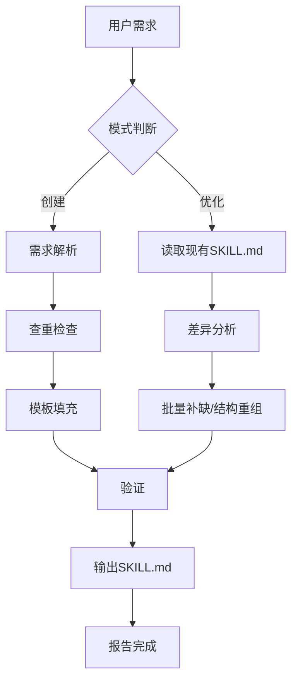

# Skill Creator — 元技能

> **一句话概括**：帮你快速创建标准化 Hermes Skills，或重构现有 Skills 为规范格式。
> **触发词**：`创建skill`、`生成skill`、`标准化skill`、`优化skill`

---

## 1. 概述 (Overview)

**Purpose**: 此 Skill 解决三个问题：
1. **创建新 Skill** — 根据需求描述，自动生成标准化的 SKILL.md
2. **优化现有 Skill** — 将非标准格式的 Skill 重构为规范 frontmatter + 结构化正文
3. **批量标准化** — 对多个 Skills 统一补缺字段

**When to Use**:
- 需要为新工作流创建 Skill 时
- 发现某个 Skill 缺少 frontmatter 标准字段时
- 想了解当前 Skills 的规范状态时

**核心原则（匠石原则）**：能批量脚本化的不做手工修改。frontmatter 的补缺用代码完成，正文的优化用 LLM 完成。

## 2. 输入 (Input)

| 输入项 | 来源 | 格式 | 说明 |
|--------|------|------|------|
| 需求描述 | 用户对话 | 自然语言 | 要创建/优化的 Skill 的功能描述 |
| 模板文件 | skills/productivity/skill-template/SKILL.md | YAML+Markdown | 标准 frontmatter + 正文模板 |
| 现有 Skill | skills/<category>/<name>/SKILL.md | Markdown | 要重构的 Skill |

## 3. 触发条件 (Trigger)

- **用户触发词**: "创建skill"、"生成skill"、"标准化skill"、"优化skill"、"新skill"
- **自动触发**: 当用户描述一个新工作流且需要 Skill 化时

## 4. 工作流 (Workflow)

### 模式 A：创建新 Skill
1. **需求解析**：解析用户描述的 Skill 功能、输入输出、工作流
2. **查重检查**：搜索现有 Skills 是否已有相似功能
3. **模板填充**：复制 skill-template，填充 frontmatter 和正文
4. **验证**：检查必填字段是否完整、tags 是否合规
5. **输出**：保存到 skills/<category>/<skill-name>/SKILL.md

### 模式 B：优化现有 Skill
1. **读取**：加载目标 SKILL.md
2. **差异分析**：对照 skill-template，找出缺失字段、格式差异
3. **批量修复**：补 category/tags/author 等机械性字段（用代码）
4. **结构重组**：将正文重组为概述/输入/触发/工作流/输出五章
5. **输出**：覆盖原文件，报告变更

## 5. 输出 (Output)

| 输出文件 | 路径 | 格式 | 说明 |
|----------|------|------|------|
| SKILL.md | skills/<category>/<name>/SKILL.md | YAML+Markdown | 标准化后的技能文件 |

## 6. 工作流图 (Workflow Diagram)



## 7. MMSkills增强模式（2026-05-19新增）

对于**视觉Agent/多模态skill**，模板支持以下增强字段：

### 7.1 State元数据
在YAML frontmatter中定义关键运行时状态：
```yaml
multimodal: true
states:
  - id: "state_1"
    name: "搜索框就绪"
    stage: "entry_state"       # entry_state / operation_state / verification_state
    when_to_use: "..."
    when_not_to_use: "..."
    visible_cues: ["搜索框可见", "搜索框可交互"]
    verification_cue: "确认搜索框可交互而非只读"
visual_references:
  - images/state1_full.png
```

### 7.2 视觉参考文件
图片放在 `skill_dir/Images/` 目录下，在正文中使用Markdown引用。

### 7.3 使用场景
- GUI操作技能（浏览器/桌面应用）
- 游戏操作技能
- 需要视觉状态判断的自动化流程

## 8. 注意事项 (Pitfalls / Caveats)

1. **不要覆盖用户手动改动**：优化前检查是否有自定义内容，保留用户意图
2. **category 从目录名自动推导**
3. **tags 首字母大写**：英文大写，中文保持原样
4. **version 递增语义化**：重构时 +0.1.0

## 8. 参考文件

本skill附带以下参考文件，记录了在会话中沉淀的工具创建模式：

- `references/izu-toolkit-patterns.md` — IZU风格Python CLI工具创建模式，包括跨模块导入、session格式处理、URL超时陷阱、cron部署、输出结构
- `references/izu-test-patterns.md` — IZU模块测试编写模式，包括mock陷阱（random内部import、Path.read_text、Path.glob只读属性、os.path.getmtime路径存在性）、compact JSON与count_turns兼容性、推荐的测试结构
