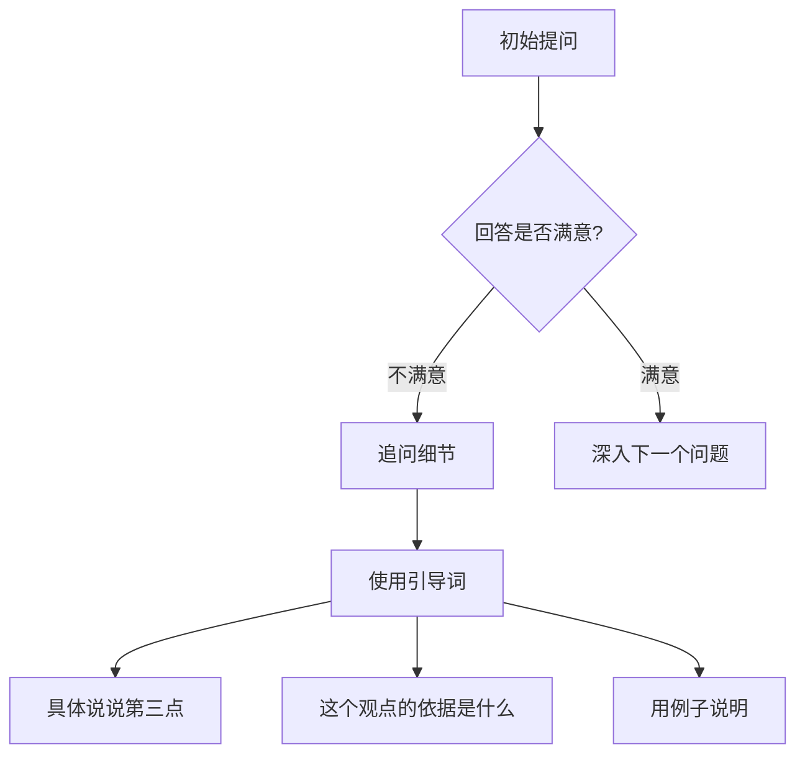

# NotebookLM 完全手册（初学者版）

> 来源: notebooklm-manual-v1.0.md（用户存入 wiki_dropbox）

# NotebookLM 完全手册（初学者版）
## Chapters 1-5 · 从入门到实战

---

> **版本**: v1.0 | **更新日期**: 2026年5月 | **适用对象**: 所有希望用AI提升研究和学习效率的用户

---

# 目录

- [第一章：认识NotebookLM——你的AI研究助手](#第一章认识notebooklm你的ai研究助手)
- [第二章：快速开始](#第二章快速开始)
- [第三章：支持的来源与格式](#第三章支持的来源与格式)
- [第四章：核心功能详解](#第四章核心功能详解)
- [第五章：实战案例](#第五章实战案例)

---

# 第一章：认识NotebookLM——你的AI研究助手

## 1.1 一句话说清楚

**NotebookLM 是谷歌推出的AI笔记本——一个「只知道自己告诉过它什么」的私人AI研究助手。**

和ChatGPT那种什么都知道的通用AI不同，NotebookLM只有一个原则：**你喂给它什么材料，它就用什么材料回答你。** 超出你提供的材料范围，它不会瞎编，不会"自由发挥"。

> Google 官方定义：NotebookLM is a private AI research assistant that only knows what you tell it — grounded in your sources, powered by Gemini.

## 1.2 用生活比喻理解

### 图书馆管理员类比

想象你请了一位**私人图书馆管理员**：

- **你给了它一个书架（你的笔记本）**，里面只放你选的书（你的资料）
- **你对它提问时**，它只从这个书架里翻书找答案
- **如果书架上没有**，它会说"这片暂时不在我了解的范围内"，而不是自己编一个答案
- **每个回答都会告诉你**："答案来自第3本书的第42页"

> 这就是 RAG（检索增强生成，Retrieval Augmented Generation）的核心思想。NotebookLM 不是依靠网络上所有知识来回答，而是只从你上传的文档中"检索"事实，再"生成"回答。

### 为什么这很重要？

| 对比项 | 普通AI聊天（如ChatGPT） | NotebookLM |
|--------|------------------------|------------|
| 信息来源 | 训练数据中的全网知识 | 你上传的指定资料 |
| 幻觉风险 | 较高，可能胡编 | 极低，严格限定来源 |
| 引用溯源 | 无或模糊 | 每个回答都标注来源段落 |
| 隐私控制 | 你的对话可能被用于训练 | 你的资料不会被用来训练模型 |

## 1.3 发展简史

| 时间 | 事件 | 意义 |
|------|------|------|
| 2023年5月 | Google I/O 发布"Project Tailwind" | 内部代号，最早的原型产品 |
| 2023年7月 | 更名为 NotebookLM | LM = Language Model，正式命名 |
| 2024年6月 | 向全球用户开放（含中国地区） | 只要有谷歌账号即可使用 |
| 2024年9月 | 推出 Audio Overviews（音频概述） | 爆款功能，文档变播客，全网刷屏 |
| 2025年 | 支持音频文件上传、语音定制 | 功能进一步完善 |

### 从 Tailwind 到 NotebookLM

"Tailwind"（顺风）是内部代号，寓意"让研究像顺风一样顺畅"。正式名称中的 **LM** 代表 Language Model（语言模型），而 **Notebook** 强调了它的核心定位：一个**以资料为中心的笔记工具**，而非聊天机器人。

### 2024年爆款功能：Audio Overviews

2024年9月，NotebookLM 推出了 Audio Overviews 功能——上传你的文档，AI会自动生成一段**两个AI主持人对话讨论**的播客（英文）。这个功能在社交媒体上病毒式传播，被称为"最令人惊艳的AI应用之一"。

> 许多人第一次用NotebookLM，就是因为看到有人把学术论文、商业报告甚至自己的日记变成了一个制作精良的播客节目。

## 1.4 NotebookLM 与同类产品对比

| 维度 | NotebookLM | ChatGPT | Perplexity | Obsidian AI |
|------|-----------|---------|------------|-------------|
| **核心定位** | 基于资料的AI笔记本 | 通用AI助手 | AI搜索引擎 | AI辅助笔记 |
| **信息来源** | 你上传的资料 | 全网知识（训练数据） | 实时搜索+部分来源 | 你的Obsidian笔记库 |
| **回答是否受限于资料** | ✅ 是，严格限定 | ❌ 否，自由发挥 | ❌ 否，搜索全网 | ✅ 是，限定于笔记库 |
| **引用标注** | ✅ 精确到原文段落 | ❌ 无/模糊 | ⚠️ 有来源链接 | ✅ 有标注 |
| **音频播客生成** | ✅ Audio Overviews | ✅ ChatGPT语音对话 | ❌ 无 | ❌ 无 |
| **免费使用** | ✅ 完全免费 | ⚠️ 免费版有限制 | ⚠️ 免费版有限制 | ✅ 本地免费 |
| **最大来源数** | 50个/笔记本 | N/A | N/A | 无限制 |
| **隐私保护** | 极高（不用于训练） | 一般 | 一般 | 极高（本地） |
| **适合场景** | 深度研究、学习、写作 | 日常问答、创作 | 快速信息检索 | 个人知识管理 |

### 社区点评

> **@林三（AI产品观察者）**
> **适合人群**: 所有需要做深度研究的用户
> **内容概览**: NotebookLM 是当前最被低估的AI工具之一。它不做ChatGPT能做的所有事，但在"基于资料做研究"这个场景上，是无可替代的。
> **为什么值得看**: 如果你经常需要处理大量文档（论文、报告、合同），NotebookLM 不是锦上添花，而是工作流革命。
> **一句话评价**: **ChatGPT 是百科全书，NotebookLM 是你私人的文献助手。**

---

# 第二章：快速开始

## 2.1 准备工作

你只需要两样东西：

1. **一个谷歌账号**（Gmail 即可）
2. **一个现代浏览器**（Chrome/Edge/Firefox 均可）

> 不需要付费，不需要安装软件，不需要信用卡。

## 2.2 第一步：访问 NotebookLM

1. 在浏览器中打开 **[notebooklm.google](https://notebooklm.google)**
2. 使用你的谷歌账号登录
3. 你会看到一个简洁的界面，中间是"Create Notebook"（创建笔记本）按钮


> **小提示**: NotebookLM 目前支持中文界面。如果你看到的是英文，可以在设置中切换语言。

## 2.3 创建你的第一个笔记本

1. 点击 **"Create Notebook"**（创建笔记本）
2. 系统会弹出一个对话框，让你输入笔记本名称
3. 输入：**"我的第一个项目"**
4. 点击创建

> 一个"笔记本"（Notebook）就是一个项目容器。每个笔记本可以独立上传资料、做笔记、生成内容。不同项目之间互不干扰。

## 2.4 添加你的第一个资料

创建笔记本后，你会看到资料添加页面。左上角有 **"Add Source"**（添加来源）按钮。

### 实操示例：用一篇网页文章试试手

**场景**: 你读到一篇好文章，想用AI帮你提炼要点

**操作步骤**:

1. 点击 **"Add Source"**
2. 选择 **"Website"**（网站）
3. 粘贴文章链接，例如：
   ```
   https://zh.wikipedia.org/wiki/人工智能
   ```
4. 点击 **"Insert"**
5. 等待几秒钟，NotebookLM 会读取网页内容

> 首次尝试时，建议用一篇你熟悉的中文文章。这样你可以验证AI的回答是否准确。

### 添加成功后的界面

成功添加资料后，你会看到：
- 左侧是「来源列表」（Sources），显示已添加的资料标题
- 右侧是「聊天区」（Chat），可以输入问题
- 中间是「笔记区」（Notes），可以保存你的思考

## 2.5 问你的第一个问题

### 示例对话

资料已添加，现在开始提问：

**你问**:
```
这篇文章主要讲了什么？用三点总结。
```

**NotebookLM 回答**（示例）:
```
根据你提供的资料，这篇文章主要讲了以下三点：

1. 人工智能的定义和发展历史
2. 当前AI技术的主要应用领域（包括自然语言处理、计算机视觉等）
3. AI技术面临的挑战和未来发展方向

> 📝 引用自来源: "人工智能"维基百科页面
```

**你继续问**:
```
这篇文章提到了哪些具体的AI应用案例？
```

**NotebookLM 回答**:
```
根据你提供的资料，文章中提到的具体AI应用案例包括：

1. 医疗领域的影像诊断AI
2. 自动驾驶中的计算机视觉技术
3. 语音助手中的自然语言处理

> 📝 引用来源: [文章段落3]、[文章段落5]
```

### 关键技巧

- **点击引用标记**：回答中的引用数字或段落标记是可以点击的，点击后会自动跳转到原文对应位置
- **追问细节**：如果你觉得某个回答太简略，直接说"详细说说第三点"
- **要求格式**：可以说"用表格对比"、"列一个时间线"、"用小学生也能听懂的话解释"

## 2.6 做笔记

NotebookLM 中的笔记功能让你可以在AI回答旁边记录自己的想法：

1. 在AI回答下方，找到 **"Add Note"**（添加笔记）按钮
2. 点击后输入你的笔记内容，例如：
   ```
   这篇文章提到的AI在医疗领域的应用，和我上周读的论文有重叠。
   可以进一步研究：医学影像AI的准确率数据。
   ```
3. 笔记会自动保存在笔记本中

> 笔记可以像便利贴一样粘在回答旁边。当你以后回顾时，既能看AI的回答，也能看你当时的思考。

## 2.7 生成你的第一个 Audio Overview（音频概述）

这是 NotebookLM 最惊艳的功能之一。

**操作步骤**:

1. 在笔记本页面右上角，找到 **"Notebook Guide"**（笔记本导览）按钮
2. 在弹出的面板中，找到 **"Audio Overview"**（音频概述）
3. 点击 **"Generate"**（生成）
4. 等待约2-5分钟（取决于资料长度）
5. 生成完成后，你会得到一个MP3文件，可以直接在线播放或下载

**第一次试听时你会惊讶**：两个AI主持人用自然的语气、有来有回地讨论你的资料，就像真正的播客节目。

> **注意**: Audio Overviews目前主要生成英文对话。对于中文资料，AI主持人会以英文讨论中文内容。如果要生成中文音频，建议使用其他工具配合。

## 2.8 快速开始检查清单

完成以下事项，你就可以说"我入门了"：

- [ ] 创建了至少1个笔记本
- [ ] 添加了至少1个来源（网站/文档）
- [ ] 问了至少3个问题，并看了引用溯源
- [ ] 添加了至少1条笔记
- [ ] 尝试生成了1次 Audio Overview

---

# 第三章：支持的来源与格式

## 3.1 总览

NotebookLM 支持多种资料格式。截至2026年5月，支持情况如下：

| 来源类型 | 支持情况 | 最大数量 | 备注 |
|---------|---------|---------|------|
| PDF | ✅ 支持 | 50个/笔记本 | 含扫描版PDF（OCR） |
| Google Docs | ✅ 支持 | 50个/笔记本 | 需拥有查看权限 |
| 网页（URL） | ✅ 支持 | 50个/笔记本 | 自动抓取正文 |
| YouTube 视频 | ✅ 支持 | 50个/笔记本 | 使用字幕/转录文本 |
| 纯文本（粘贴） | ✅ 支持 | 50个/笔记本 | 直接复制粘贴 |
| 音频文件（MP3/WAV/M4A） | ✅ 支持 | 50个/笔记本 | 2025年新增 |
| EPUB 电子书 | ❌ 不支持 | - | 需先转PDF |
| 图片（单独） | ❌ 不支持 | - | 只能从PDF中提取文字 |
| Markdown 文件 | ⚠️ 间接支持 | - | 导出为PDF或粘贴为文本 |

> **每个来源上限**: 每个来源文件建议不超过50万字。每个笔记本最多50个来源。

## 3.2 PDF 文件

### 适用场景
- 学术论文（期刊文章、会议论文）
- 研究报告（行业分析、市场调研）
- 书籍章节（扫描版或电子版）
- 合同文档（条款分析）

### 实操示例：上传学术论文

**场景**: 你有一篇关于"大语言模型在医疗领域的应用"的英文论文PDF，想快速理解核心内容。

**操作步骤**:

1. 点击 **"Add Source"** → 选择 **"PDF"**
2. 从电脑中选择文件：`llm_healthcare_review.pdf`
3. 等待上传，NotebookLM 会自动解析PDF中的文字
4. 上传完成后，你可以问：

```
用中文总结这篇论文的研究方法、主要发现和局限性。
```

**预期回答**:
```
根据提供的论文，以下是对该研究的总结：

研究方法：
- 系统综述了2020-2024年间发表的47篇相关论文
- 重点关注LLM在诊断辅助、病历摘要和患者沟通三方面的应用
- 采用了PRISMA系统性综述框架

主要发现：
1. LLM在病历摘要生成方面准确率达到92%
2. 诊断辅助场景下，LLM+医生组合优于单独任一者
3. 患者沟通场景仍需谨慎，存在幻觉风险

局限性：
- 样本主要由英文文献构成
- 多数研究缺乏真实临床环境的验证
- 未充分评估不同LLM架构间的差异

> 📝 来源: llm_healthcare_review.pdf, 第3-5页
```

### 扫描版PDF

如果PDF是扫描图片（而非文字版），NotebookLM 使用OCR（光学字符识别）提取文字。不过：
- 中文OCR准确率较好，但手写体效果不佳
- 表格和复杂排版可能解析出错
- 建议优先使用文字版PDF

## 3.3 Google Docs

### 适用场景
- 团队协作的会议记录
- 正在撰写的论文草稿
- 个人的日记或思考笔记
- 项目需求文档

### 实操示例：分析会议记录

**场景**: 团队每周召开站会，你有一个Google Docs记录了连续4周的会议纪要，想找出高频议题。

**操作步骤**:

1. 在Google Docs中打开文档，确保你的谷歌账号有**查看权限**
2. 在NotebookLM中点击 **"Add Source"** → **"Google Docs"**
3. 系统会弹出Google Drive文件选择器
4. 选择对应的会议纪文档
5. 添加完成后提问：

```
分析这四周的会议记录，找出：
1. 每次会议讨论最多的三个主题
2. 哪些问题反复出现
3. 各主题讨论时长的变化趋势
```

> **注意**: 如果Google Docs设置了限制访问，NotebookLM可能无法读取。确保文档权限为"拥有链接者可查看"或直接授权给你的谷歌账号。

## 3.4 网页链接

### 适用场景
- 新闻文章（需要分析报道角度）
- 博客文章（精华提炼）
- 维基百科页面（知识聚合）
- 公司官网（产品信息收集）

### 实操示例：分析多篇新闻报道

**场景**: 你想了解各媒体对"某新产品发布"的不同报道角度。

**操作步骤**:

1. 收集3-5篇不同媒体的报道链接
2. 逐个添加到NotebookLM
3. 提问：

```
对比这几篇报道，分析：
1. 各媒体报道的侧重点有什么不同
2. 哪个角度最全面
3. 是否存在报道偏差
```

**预期回答**：
```
根据你提供的5篇报道来源，分析如下：

各媒体侧重点对比：
| 媒体 | 侧重点 | 数据使用 |
|------|--------|---------|
| 媒体A | 技术细节、参数对比 | 使用了产品规格表 |
| 媒体B | 市场影响、股价分析 | 引用了分析师评论 |
| 媒体C | 用户体验、评测感受 | 使用了实际体验报告 |
| 媒体D | 行业格局、竞争分析 | 对比了竞品数据 |
| 媒体E | 消费者角度、性价比 | 引用了价格和配置 |

角度最全面：媒体A（覆盖了技术、市场和用户三个层面）

报道偏差提示：媒体B和媒体D的报道分别倾向于各自投资者的立场
```

### 抓取限制

- 需要登录的页面（如付费墙文章）：❌ 无法抓取
- 动态加载的页面（大量JavaScript）：⚠️ 可能只抓取到部分内容
- 社交媒体帖子（Twitter/X、微博）：⚠️ 有限支持

> **小技巧**: 如果网页内容需要登录才能查看，可以先复制文字→粘贴为纯文本来源。

## 3.5 YouTube 视频

### 适用场景
- 学术讲座录像
- TED演讲
- 教程/课程录像
- 产品发布视频
- 播客类视频

### 实操示例：理解一个技术讲座

**场景**: 你找到一个关于"Transformer架构详解"的YouTube讲座（30分钟），想快速获取核心知识点。

**操作步骤**:

1. 打开YouTube视频，复制链接
2. 在NotebookLM中点击 **"Add Source"** → **"YouTube"**
3. 粘贴视频URL
4. 等待NotebookLM获取视频字幕/转录文本
5. 上传完成后提问：

```
这个讲座解释了Transformer的哪些核心概念？
用通俗的语言解释 Self-Attention 机制。
```

**预期回答**：
```
根据该讲座的转录文本，讲座中解释的Transformer核心概念包括：

1. **Self-Attention（自注意力机制）**: 讲座中比喻为"模型在看句子时，自动判断哪些词更重要"
2. **Multi-Head Attention（多头注意力）**: 同时从多个角度理解句子
3. **Positional Encoding（位置编码）**: 告诉模型词语的顺序
4. **Encoder-Decoder结构**: 编码器负责理解，解码器负责生成

关于Self-Attention的具体解释（基于讲座第8-15分钟内容）：
Self-Attention让模型在处理每个词时，计算它和其他所有词的"相关性得分"。比如在句子"苹果很好吃，我每天吃一个"中，"苹果"和"吃"的相关性高，模型就能理解"吃"的对象是"苹果"。

> 📝 来源: YouTube视频 "Transformer架构详解" (8:23 - 15:47)
```

### 注意事项

- **需要字幕**: NotebookLM 读取的是视频的**字幕/转录文本**。如果视频没有字幕（自动生成或人工上传），则无法使用
- **中文视频**: 中文视频只要有中文字幕就可以正常工作
- **长视频**: 1-2小时的视频也能处理，但生成速度可能较慢
- **多语言**: 支持多种语言的字幕，前提是YouTube上有对应的字幕轨道

## 3.6 纯文本（粘贴）

### 适用场景
- 从各种渠道复制的内容
- 邮件内容分析
- 代码注释和文档
- 无法直接上传的格式（如EPUB转文本）

### 实操示例

**场景**: 你收到一封长邮件，内含一份项目方案的文字描述，想帮自己提炼要点。

**操作步骤**:

1. 复制邮件全文
2. 点击 **"Add Source"** → **"Pasted text"**
3. 粘贴文字，输入来源名称（如"Q3项目方案邮件"）
4. 提问：

```
帮我从这个项目方案中提取：
1. 项目的核心目标
2. 时间线和关键里程碑
3. 需要的资源和预算估算
4. 潜在风险
```

## 3.7 音频文件（2025年新增功能）

### 适用场景
- 会议录音
- 采访录音
- 课堂录音
- 语音备忘录
- 播客音频

### 实操示例：分析采访录音

**场景**: 你对一位行业专家进行了一次30分钟的采访（MP3格式），想提取核心观点。

**操作步骤**:

1. 点击 **"Add Source"** → **"Audio"**
2. 选择MP3文件上传
3. 等待NotebookLM进行语音转文字处理
4. 上传完成后提问：

```
这位专家在采访中提到的三个最重要的观点是什么？
有没有提到任何具体的数字或数据？
```

### 支持格式

| 格式 | 支持情况 | 说明 |
|------|---------|------|
| MP3 | ✅ 支持 | 最常见格式 |
| WAV | ✅ 支持 | 无损格式，文件较大 |
| M4A | ✅ 支持 | Apple生态常用 |
| FLAC | ❌ 不支持 | 建议转WAV |
| AAC | ⚠️ 部分支持 | 建议转MP3 |

> **限制**: 每个音频文件建议不超过2小时。如果录音很长，建议分段上传。

---

# 第四章：核心功能详解

## 4.1 基于来源的问答系统

### 这是NotebookLM的"灵魂"功能

NotebookLM 的回答机制可以用一句话概括：**它只回答你给的资料里有依据的问题。** 这种机制叫做 Source-Grounded Q&A（基于来源的问答）。

### 工作原理

```
你提问 → AI理解问题 → 在资料中检索相关内容 → 
提取相关段落 → 基于这些段落生成回答 → 
在每个引用处标注来源
```

### 引用系统详解

每个回答旁的引用标注是NotebookLM最值得学习的功能：

**引用形式**:
```
根据资料显示，[LLM在医疗诊断中的准确率达到92%](📝 来源: research_paper.pdf, 第4页)
```

**三件事你需要知道**:

1. **点击可跳转**: 点击引用标记，会直接跳转到原文中对应的段落
2. **多个来源综合**: 如果一个回答引用了多个来源，每个都会标注清楚
3. **可验证**: 你随时可以打开原文，验证AI的理解是否正确

### 实操对比：有来源 vs 无来源

**用ChatGPT问同样的问题**:
```
Q: Transformer模型的参数量一般是多少？
A: 这取决于具体模型...（给出一个模糊的区间）
```

**用NotebookLM**（上传了一篇关于Transformer的论文后）:
```
Q: Transformer模型的参数量一般是多少？
A: 根据你提供的论文，文中研究的Base模型参数为6500万，Big模型为2.13亿。
📝 来源: transformer_paper.pdf, 第3页
```

### 追问技巧



## 4.2 笔记系统

### 笔记的作用

笔记是你在研究过程中产生的**个人思考**，与AI的回答是互补关系：

- **AI回答**: 基于资料的客观总结
- **你的笔记**: 你的主观思考、联想、质疑、行动计划

### 如何管理笔记

**添加笔记**:
- 在任何一个AI回答下方，点击"Add Note"
- 或者点击页面右侧的笔记面板，直接创建新笔记

**笔记示例**:
```
📝 标题: 关于论文方法的思考
该论文使用的实验方法存在一个潜在问题：
样本量只有47篇，且主要是英文文献。
这可能导致结论的普适性受限。
——下一步：找更多非英文来源的研究
```

**管理笔记**:
- **查看所有笔记**: 点击右侧的"Notes"面板
- **搜索笔记**: 支持全文搜索
- **导出笔记**: 可以复制或下载
- **删除笔记**: 不需要的笔记可以删除

### 笔记的最佳实践

1. **记录思考而不是复述**: 笔记的价值在于你的分析，而不是AI已经说过的内容
2. **用标签分类**: 可以在笔记中添加`#关键发现` `#待验证` `#行动项` 等标签
3. **链接到AI回答**: 笔记会自动关联到你添加笔记时的那个回答

## 4.3 自动生成内容

NotebookLM 的右侧面板提供了多种自动生成功能，统称为 **Notebook Guide**（笔记本导览）。

### 功能总览

| 功能 | 英文名称 | 作用 | 生成时间 |
|------|---------|------|---------|
| 学习指南 | Study Guide | 自动生成学习问题、关键词和概念解释 | 10-30秒 |
| 常见问题 | FAQ | 基于资料生成最常见的问答对 | 10-30秒 |
| 简报文档 | Briefing Doc | 生成执行摘要，适合快速汇报 | 20-40秒 |
| 时间线 | Timeline | 按时间顺序提取事件 | 15-30秒 |
| 音频概述 | Audio Overview | 生成AI播客对话 | 2-5分钟 |

### 学习指南（Study Guide）

**适用场景**: 学生备考、自学新领域、培训材料准备

**生成的典型内容**:
```
📚 学习指南：Transformer架构

🔑 关键概念
1. Self-Attention - 模型自行判断输入中各部分的重要性
2. Multi-Head Attention - 从多个表示空间同时关注
3. Positional Encoding - 为序列中的位置编码信息

❓ 自测问题
1. Transformer和RNN的主要区别是什么？
2. 为什么需要Multi-Head而不是单头？
3. Positional Encoding为什么重要？

📖 核心术语表
- Query: 查询向量，用于匹配信息
- Key: 键向量，被查询的对象
- Value: 值向量，实际提取的信息
```

### 常见问题（FAQ）

**适用场景**: 快速了解一个新领域、准备面试、客户问答

**生成的典型内容**:
```
❓ FAQ - 大语言模型基础

Q1: 什么是大语言模型？
A: 大语言模型是基于Transformer架构，在海量文本上预训练的语言模型...

Q2: 大语言模型能做什么？
A: 主要能力包括：文本生成、翻译、摘要、问答、代码编写...

Q3: 大语言模型的局限性是什么？
A: 主要局限包括：幻觉问题、知识截止日期、缺乏真实理解...
```

### 简报文档（Briefing Doc）

**适用场景**: 团队汇报、项目立项、向管理者说明

**生成的典型内容**:
```
📋 简报文档：2024年AI行业趋势分析

执行摘要
2024年AI行业呈现三大趋势：多模态模型崛起、端侧AI部署加速、
AI Agent框架成熟。本报告基于5篇行业分析文章整理。

关键发现
1. 多模态模型：从文本扩展到图像、视频、音频...
2. 端侧AI：手机和PC本地运行AI模型成为可能...
3. AI Agent：从单一任务到自主规划执行...

建议行动
- 关注多模态技术在垂直领域的机会
- 评估端侧AI对产品路线图的影响
- 试点AI Agent在客服场景的应用
```

### 时间线（Timeline）

**适用场景**: 历史研究、项目复盘、事件梳理

**生成的典型内容**:
```
📅 时间线：ChatGPT发展历程

2018年6月
GPT-1发布，1.17亿参数

2019年2月
GPT-2发布，15亿参数，因安全性考虑延迟发布

2020年6月
GPT-3发布，1750亿参数，API开放

2022年11月
ChatGPT发布，两个月破亿用户

2023年3月
GPT-4发布，多模态能力
```

### 如何选择最合适的功能？

```
你正在做什么？ → 推荐功能
备考学习 → 学习指南
快速了解新领域 → FAQ
向老板汇报 → 简报文档
研究历史事件 → 时间线
通勤时"听"知识 → 音频概述
```

## 4.4 Audio Overviews 深度解析

### 它是怎么工作的？

Audio Overviews 是NotebookLM最受瞩目的功能。它的工作原理是一个**多步骤的AI流水线**：

```
你的资料（文档/PDF/笔记）
       ↓
第一步：Gemini 模型分析所有资料
       ↓
第二步：AI生成播客脚本（包含对话、讨论、提问、举例）
       ↓
第三步：Chirp 3 TTS 文本转语音（Text-to-Speech）
       ↓
第四步：两个AI主持人生成自然的对话音频
       ↓
第五步：输出 MP3 文件（时长10-25分钟）
```

### 为什么它听起来这么自然？

传统的文本转语音听起来像机器朗读，但NotebookLM的Audio Overviews不同：

- **两个主持人对话式**：一个人提问引导，一个人深入解释
- **自然的语气词**：有"嗯"、"你知道"、"确实"等口语化表达
- **观点碰撞**：主持人之间可以有不同见解的讨论
- **引经据典**：会引用你资料中的具体内容
- **总结升华**：最后会对讨论进行总结

> **一位用户说**："我第一次听的时候以为是真的两个人在讨论我的论文。直到他们讨论到我最熟悉的部分时我才发现——他们说的是对的，但语调和停顿太像真人了。"

### 生成步骤

**Step 1**: 确保笔记本有至少1个来源（建议3-15个来源效果最好）
**Step 2**: 点击右上角 **"Notebook Guide"**
**Step 3**: 在弹出面板中点击 **"Generate"**（生成音频概述）
**Step 4**: 等待2-5分钟（取决于资料数量和长度）
**Step 5**: 播放试听，如果满意可以下载MP3

### 最佳实践

**什么情况下效果好**:
- ✅ 3-15个来源，主题集中
- ✅ 资料之间有逻辑关联
- ✅ 包含具体数据和案例
- ✅ 英文资料（目前效果最好）

**什么情况下效果差**:
- ❌ 只有1个短文档（内容不够丰富）
- ❌ 主题过于分散（缺乏主线）
- ❌ 纯表格数据（缺乏叙述性内容）
- ❌ 需要专业术语精确发音的内容

### 长度控制

- 默认生成：10-25分钟
- 无法手动指定长度
- 资料越多，生成的音频越长
- 可以通过增减来源来控制

### 使用方法

| 用途 | 说明 |
|------|------|
| 通勤学习 | 把论文变成播客，路上听 |
| 研究快速概览 | 快速了解一个领域的文献 |
| 课后复习 | 把课堂笔记变成对话复习 |
| 团队同步 | 生成项目简报音频，群内分享 |
| 非母语研究 | 生成英文音频，边听边理解 |

### 社区点评

> **@技术播客爱好者（小红书）**
> **适合人群**: 通勤时间长、喜欢听播客学习的人
> **内容概览**: 把枯燥的论文变成两个AI主持人的插科打诨。虽然深度有限，但作为"第一遍概览"非常高效。
> **为什么值得看**: 把一个需要2小时精读的文献，压缩成20分钟的听觉体验。适合先听后读。
> **一句话评价**: **读论文之前先"听"一下，效率翻倍。**

> **@AI产品观察（知乎）**
> **适合人群**: 产品经理、研究员、终身学习者
> **内容概览**: NotebookLM的Audio Overviews是目前最接近"AI播客"的产品。不是简单的文章朗读，而是有思考的对话。
> **为什么值得看**: 如果你想了解为什么这个功能在硅谷病毒式传播——因为它真的让人"哇"出来。
> **一句话评价**: **2024年最惊艳的AI功能之一，但中文支持还需加油。**

## 4.5 各功能组合使用

NotebookLM 的真正威力在于**各功能的组合**：

```
典型的工作流：

1️⃣ 添加资料 → PDF + 网页 + YouTube视频
2️⃣ 自动生成 → 先跑一份简报文档（了解全局）
3️⃣ 逐点深挖 → 基于简报中的发现，精准提问
4️⃣ 记录笔记 → 写下自己的分析和行动计划
5️⃣ 音频听学 → 生成Audio Overview通勤路上听
6️⃣ 回到资料 → 点击引用，回到原文验证
```

---

# 第五章：实战案例

本章通过四个真实的场景，展示NotebookLM在不同领域的具体用法。每个案例都包含：背景、操作步骤、实际提示词示例、预期结果。

## 案例一：学生备考

### 背景

**人物**: 小明，大三计算机系学生
**任务**: 两周后考《机器学习》期末，有三本教材PDF（总计约800页）
**痛点**: 书太厚，不知道重点在哪，自己总结太慢

### 步骤

#### Step 1: 创建笔记本

```
新建笔记本：机器学习期末复习
```

#### Step 2: 上传资料

```
添加3个来源：
1. 教材PDF: 《统计学习方法》李航
2. 教材PDF: 《机器学习》周志华（西瓜书）
3. 教材PDF: 《Deep Learning》Goodfellow（花书）
   ——每本只上传相关章节即可
```

#### Step 3: 生成学习指南

点击 Notebook Guide → Study Guide

**预期输出**:
```
📚 机器学习期末复习指南

核心主题：
1. 监督学习（回归、分类）
2. 无监督学习（聚类、降维）
3. 集成学习（Bagging、Boosting）
4. 深度学习基础（神经网络、反向传播）

关键公式：
- 线性回归: y = wx + b + ε
- 逻辑回归: P(y=1|x) = 1/(1+e^(-wx))
- SVM对偶问题: max Σα - 1/2 ΣΣα_i·α_j·y_i·y_j·K(x_i,x_j)

自测问题：
1. 偏差-方差权衡是什么？
2. SVM中核函数的作用？
3. 过拟合的解决办法？
```

#### Step 4: 针对难点提问

```
我学不懂SVM的核函数，请用西瓜书第6章的内容，
用最简单的例子解释核函数的作用。
SVM为什么要用对偶问题求解？
```

**预期回答**:
```
根据西瓜书第6章（来源: 周志华《机器学习》第6章），
我来用简单例子解释：

核函数的作用：
想象你在二维平面上有一些数据点，它们是环形分布的，
无法用一条直线分开。核函数就像"升维魔法"——
把数据映射到三维空间，这样在三维空间中它们就变成可分
的了。你不需要真的去计算高维空间的坐标，核函数直接
计算高维空间中的"相似度"。

为什么用对偶问题？
原始问题是"找一个最好的分隔超平面"，
对偶问题变成了"找出哪些样本点对分隔最重要"
（这些就是支持向量）。对偶问题更容易引入核函数，
而且求解效率更高。

📝 来源: 周志华《机器学习》第6.2-6.3节
```

#### Step 5: 生成知识点速记笔记

```
帮我整理：
1. 每种算法的优缺点对比表
2. 常用面试题和解答
3. 公式速查卡
```

#### Step 6: 生成 Audio Overview

在通勤路上听AI讲机器学习核心概念。

**效果**: 两周后，小明用这些资料配合笔记，节省了至少20小时的整理时间。

### 案例一总结

| 步骤 | 做了什么 | 节省时间 |
|------|---------|---------|
| 上传资料 | 3本教材PDF | 0（一次性投入） |
| 生成学习指南 | 自动获取知识框架 | ~3小时 |
| 难点提问 | 针对性解决SVM疑问 | ~2小时（查资料+理解） |
| 生成速记 | 对比表和公式卡 | ~4小时 |
| 音频听学 | 通勤复习 | 利用碎片时间 |
| **总计节省** | | **~9小时以上** |

---

## 案例二：研究员文献综述

### 背景

**人物**: 李博士，材料科学领域博士后
**任务**: 写一篇关于"钙钛矿太阳能电池稳定性"的综述论文
**痛点**: 需要阅读20+篇论文，找出研究趋势、方法对比和关键数据

### 步骤

#### Step 1: 创建笔记本

```
新建笔记本：钙钛矿稳定性文献综述
```

#### Step 2: 上传20篇论文PDF

```
分批次添加，每次5篇，按主题分组：
批次1: 封装技术相关的5篇
批次2: 材料掺杂相关的5篇
批次3: 界面工程相关的5篇
批次4: 运行机制研究的5篇
```

#### Step 3: 跨论文检索

```
在这20篇论文中，有哪些不同的稳定性测试标准？
各家使用的测试条件（温度、湿度、光照强度）有什么差异？
```

**预期回答**:
```
根据你提供的20篇论文，关于稳定性测试标准和方法：

主要测试标准：
1. ISOS（国际有机光伏稳定性峰会）标准：被12篇论文引用
2. 企业自定义标准：5篇论文使用
3. 未明确标注标准：3篇

测试条件差异：
- 温度：85°C（14篇）、65°C（4篇）、室温（2篇）
- 湿度：85%RH（10篇）、65%RH（6篇）、未控制（4篇）
- 光照：AM1.5G标准（16篇）、LED光源（3篇）、未说明（1篇）

关键发现：测试条件的不统一导致了各研究结果难以直接对比。
这可以作为综述中"方法标准化"部分的论述依据。

📝 来源: 论文3、7、12、15、18
```

#### Step 4: 提取研究方法

```
这些论文中使用最广泛的封装材料是哪几种？
哪种封装方法的稳定性提升效果最好？
```

```
回答（在准确命中你的论文内容的前提下）：
常用的封装材料排名：
1. 环氧树脂（EPO-TEK OG116-31）：8篇论文使用
2. 聚异丁烯（PIB）：6篇论文使用
3. 原子层沉积氧化铝（ALD-Al₂O₃）：5篇论文使用

稳定性提升效果：
- ALD-Al₂O₃封装：在85°C/85%RH条件下，T80寿命提升10倍
- PIB封装：T80提升5倍
- 环氧树脂：T80提升2-3倍

📝 来源: 论文2、6、11、14、17
```

#### Step 5: 生成时间线

生成时间线功能，快速了解该领域的发展脉络。

```
📅 钙钛矿稳定性研究发展时间线

2015: 首次报道钙钛矿在500小时连续光照下的降解
2017: 引入ISOS标准进行统一测试
2019: ALD封装技术突破，T80达到1000小时
2021: 多组分掺杂策略提升本征稳定性
2023: 钙钛矿/硅叠层电池通过IEC标准测试
```

#### Step 6: 生成 Audio Overview

把20篇论文的精华浓缩成一个20分钟的播客，快速了解领域全貌。

**效果**: 李博士在一周内完成了原本需要三周的文献调研，而且还发现了之前没注意到的研究空白——测试标准不统一的问题。

### 案例二总结

| 能力 | NotebookLM的作用 | 传统方法 | 提升 |
|------|----------------|---------|------|
| 文献检索 | 跨论文综合分析 | 逐篇阅读手动对比 | 5倍速 |
| 方法对比 | 自动汇总实验条件 | 自己做表格整理 | 10倍速 |
| 趋势发现 | AI识别研究模式 | 靠经验和直觉 | 更系统 |
| 综述写作 | 提取关键论点和数据 | 手动翻文章找引用 | 3倍速 |

---

## 案例三：记者采访分析

### 背景

**人物**: 张记者，科技媒体记者
**任务**: 采访了5位AI行业专家，每人30-60分钟录音，要写一篇深度报道
**痛点**: 5段录音需要听写、整理、交叉引用，传统方法至少一天

### 步骤

#### Step 1: 创建笔记本

```
新建笔记本：AI行业趋势报道 - 采访分析
```

#### Step 2: 上传采访音频

```
添加5个音频来源：
1. 专家A_CEO.mp3（45分钟）
2. 专家B_CTO.mp3（60分钟）
3. 专家C_研究员.mp3（50分钟）
4. 专家D_投资人.mp3（40分钟）
5. 专家E_创业者.mp3（55分钟）
```

> **注意**: 每个音频上传后需要一些时间进行语音转文字。建议分批上传。

#### Step 3: 提取核心主题

```
这五位专家分别来自不同的背景（CEO、CTO、研究员、投资人、创业者），
他们各自最关注的AI趋势是什么？
有没有所有专家都提到的共同主题？
```

**预期回答**:
```
根据五位专家的采访转录，分析如下：

每位专家的核心关注点：
| 专家 | 身份 | 最关注的趋势 |
|------|------|-------------|
| A | CEO | AI落地场景、产品化、用户采纳率 |
| B | CTO | 技术架构、模型优化、基础设施 |
| C | 研究员 | 基础模型突破、注意力机制改进 |
| D | 投资人 | 市场空间、投资回报、创业公司 |
| E | 创业者 | 垂直场景机会、竞争壁垒 |

共同主题（5/5都提到）：
1. **AI Agent**（自主智能体）——2024-2025年最重要趋势
2. **多模态**——从文本到图像/视频/音频的融合
3. **成本下降**——推理成本在过去两年下降了10倍

分歧点：
- 对监管态度：研究员和创业者持谨慎态度，CEO和投资人更乐观

📝 来源: 全部5个采访转录
```

#### Step 4: 提取金句

```
帮我找出每位专家说的最具有洞察力的一句话，
可以是比喻、预测或独特的观点。
```

**预期回答**:
```
专家A（CEO）: "AI Agent就像2010年的App Store——平台已就绪，杀手应用还没出现。"

专家B（CTO）: "未来18个月，一个能跑的AI Agent需要的算力会比今天的GPT-4降低100倍。"

专家C（研究员）: "我们现在对AI的理解，相当于19世纪的物理学家对电磁学的理解——能看到现象，但还没有完整的理论。"

专家D（投资人）: "我投AI创业公司的标准不是技术有多强，而是能不能在6个月内让用户付费。"

专家E（创业者）: "大公司做通用AI，小公司做垂直AI。谁先找到PMF（产品市场匹配），谁就赢了。"
```

#### Step 5: 生成简报文档

点击 Notebook Guide → Briefing Doc

**预期输出**: 一份结构化的报道大纲

```
📋 报道简报：2025 AI行业趋势——专家访谈汇总

执行摘要
五位AI行业专家（CEO、CTO、研究员、投资人、创业者）
一致认为AI Agent是2025年最重要的技术趋势，同时多模态
和成本下降也是共同关注点。

五大核心发现
1. AI Agent元年已至
2. 多模态能力快速成熟
3. 推理成本指数级下降
4. 垂直场景比通用更有机会
5. 监管框架仍不明确

引用的关键数据
- 推理成本两年下降10x
- 明年算力需求可能降低100x
- ...

争议点
- 开源vs闭源路线之争
- 监管的力度和时机

适合引用的金句
[5条金句]
```

#### Step 6: 生成 Audio Overview

生成报道要点音频，写稿时可以随时回听。

**效果**: 张记者用3小时完成了原本需要2整天的采访整理工作，而且找到了以前自己可能遗漏的交叉联系。

### 案例三总结

| 传统方法 | 需要时间 | NotebookLM方法 | 需要时间 |
|---------|---------|---------------|---------|
| 手动听写5段录音 | 5-8小时 | 自动转文字 | 20分钟 |
| 手动整理每个采访要点 | 2-3小时 | AI提取核心主题 | 5分钟 |
| 交叉对比找出共同点 | 1-2小时 | 跨来源综合查询 | 5分钟 |
| 挑选合适引用 | 1小时 | 金句提取 | 2分钟 |
| **总计** | **9-14小时** | **总计** | **~32分钟** |

---

## 案例四：产品经理用户研究

### 背景

**人物**: 王经理，SaaS产品经理
**任务**: 分析了15份用户访谈记录（Google Docs），要写一份用户研究的报告
**痛点**: 用户需求零散，需要找出模式、优先级和actionable insights

### 步骤

#### Step 1: 创建笔记本

```
新建笔记本：Q2用户研究 - 产品功能优先级
```

#### Step 2: 上传用户访谈记录

```
添加15个Google Docs来源：
- 每个文档是一份用户访谈记录
- 用户来自不同行业（电商、教育、金融、医疗）
- 每个访谈记录包含：用户背景、痛点描述、功能期望
```

#### Step 3: 发现痛点和需求模式

```
分析这15份用户访谈记录，找出：
1. 用户最常提到的三个痛点是什么？
2. 这些痛点在不同行业用户之间有没有差异？
3. 用户最希望新增的功能是什么？
```

**预期回答**:
```
根据15份用户访谈记录分析：

Top 3痛点（按出现频次排序）：
1. 数据导入流程太复杂（12/15用户提到）
   - 电商行业：需要批量导入历史订单数据
   - 教育行业：需要兼容不同的学籍系统格式
   - 金融行业：担心数据安全合规

2. 报表生成不够灵活（10/15用户提到）
   - 用户希望可以自定义维度组合
   - 目前只能使用预设模板

3. 协作功能太弱（8/15用户提到）
   - 无法实时看到同事的修改
   - 评论功能不支持@提醒

行业差异：
- 电商用户更关注数据导入（100%）
- 医疗用户更关注数据安全和权限（75%）
- 教育用户更关注易用性和培训（80%）

用户最希望的新功能：
1. 自定义报表（10/15）
2. 批量操作工具（9/15）
3. API集成（7/15）
```

#### Step 4: 用户画像分类

```
根据这些访谈，用户可以分为几种类型？
每种类型的特点、痛点和需求是什么？
做成用户画像表。
```

**预期回答**:
```
根据访谈数据分析，可归纳为4类用户画像：

| 画像 | 典型用户 | 核心痛点 | 最想要的功能 | 占比 |
|------|---------|---------|------------|------|
| 效率驱动型 | 运营主管 | 数据导入慢、重复操作多 | 批量工具、自动化 | 40% |
| 分析深度型 | 数据分析师 | 报表不够灵活 | 自定义报表 | 27% |
| 协作依赖型 | 项目经理 | 团队协作弱 | 实时协作 | 20% |
| 安全敏感型 | 合规负责人 | 权限不足、审计困难 | 权限管理 | 13% |

这个分类可以帮助产品团队决定功能开发的优先级：
先满足占比最大的"效率驱动型"用户的需求。
```

#### Step 5: 生成行动建议

```
基于这些用户反馈，请给我一个功能优先级排序建议，
包括：建议优先级（P0/P1/P2）、预估实现难度、预期用户影响。
```

**预期回答**:
```
基于15份用户访谈分析，建议功能优先级如下：

P0（立即做，高影响，中低难度）：
1. 批量导入工具 - 覆盖40%用户的核心痛点
2. 自定义报表 - 覆盖27%用户的深层需求

P1（下一阶段，高影响，中高难度）：
3. 实时协作编辑 - 覆盖20%用户
4. API开放平台 - 覆盖高级用户需求

P2（长期规划）：
5. 高级权限管理系统
6. AI辅助报表生成

建议：P0功能预计可解决67%用户的核心痛点，
建议在下一个迭代周期（6周）内完成。
```

#### Step 6: 生成汇报文档

生成简报文档，直接用于向团队和管理层汇报。

**效果**: 王经理用半天时间完成了以往需要一周的用户研究分析，而且结果更有系统性。

### 案例四总结

| 任务 | 传统方法 | NotebookLM | 时间节省 |
|------|---------|-----------|---------|
| 阅读15份访谈记录 | 5-8小时 | 5分钟上传 | ~5小时 |
| 找出共同痛点 | 2-3小时（手动编码） | 30秒提问 | 2-3小时 |
| 用户画像分类 | 1-2小时 | 30秒提问 | 1-2小时 |
| 生成建议报告 | 2-4小时 | 10秒生成简报 | 2-4小时 |
| **总计** | **10-17小时** | **~30分钟** | **~90%时间节省** |

---

## 四个案例的通用工作流

无论你是学生、研究员、记者还是产品经理，都可以遵循这个通用工作流：

```
┌─────────────────────────────────────────┐
│  Step 1: 创建笔记本                      │
│  └→ 给笔记本起个好名字，方便后续查找      │
├─────────────────────────────────────────┤
│  Step 2: 上传资料                        │
│  └→ PDF / 网页 / YouTube / 音频 / 文本   │
│    一次不要太多，按主题分组上传效果好       │
├─────────────────────────────────────────┤
│  Step 3: 全局概览                        │
│  └→ 用"简报文档"或"FAQ"快速了解全貌       │
├─────────────────────────────────────────┤
│  Step 4: 精准提问                        │
│  └→ 针对具体问题深挖                     │
│    用追问技巧获得更详细的回答              │
├─────────────────────────────────────────┤
│  Step 5: 记录笔记                        │
│  └→ 写下你的分析和行动计划                │
├─────────────────────────────────────────┤
│  Step 6: 生成输出                        │
│  └→ 学习指南 / 简报 / 时间线 / 音频      │
│    根据你的目标选择最合适的输出格式        │
└─────────────────────────────────────────┘
```

---

# 第六章：架构原理（通俗版）

## 6.1 一句话说清

NotebookLM 的核心流程可以概括为一个六步流水线：

```
你上传资料 → AI将资料切碎（Chunk）→ 转化为密码（Embedding）
→ 建立索引（Index）→ 你的问题触发搜索（Retrieve）→ AI生成回答（Generate）
```

这套流程在技术领域被称为 **RAG（检索增强生成，Retrieval Augmented Generation）**。下面用通俗比喻解释每一步。

## 6.2 六步流水线详解

### Step 1: 上传（Upload）

你把自己拥有的资料——PDF、网页链接、YouTube视频、录音文件——上传到笔记本。

> **比喻**: 你走进图书馆，把自己私藏的一箱书放在前台，说"这些我要用"。

### Step 2: 切块（Chunk）

AI 把每个文件切成许多小段。比如一篇5000字的论文，可能被切成20段，每段250字左右。

为什么要切？因为AI模型有"上下文窗口"限制——它一次能"看"的内容是有限的。把长文档切成小块，方便后续灵活检索。

> **比喻**: 你把一本厚书拆成一个个独立的段落卡片，每张卡片上是一个完整的小知识点。

### Step 3: 向量化（Embedding）

这是最核心的一步。AI 把每一段文字**转换成一串数学向量**（几百个数字组成的数组）。这串数字像"密码"一样编码了这段话的语义。

关键是：**意思相近的段落，它们的向量也相似**。比如"苹果很好吃"和"苹果营养价值高"这两段的向量会在"数学空间"中靠得很近，而和"汽车保养技巧"的向量离得很远。

> **比喻**: 每张段落卡片都用一种特殊的"语义墨水"写上——含义相同的卡片会发出相同颜色的光。

### Step 4: 索引（Index）

所有向量被组织成一个**索引数据库**（有点像书籍末尾的关键词索引表）。这个索引让AI可以在海量段落中实时找到最相关的内容。

> **比喻**: 图书馆管理员为每张卡片建立了一套"按含义快速查找"的检索目录。

### Step 5: 检索（Retrieval）

当你提问时，AI：1）把你的问题也转换成向量；2）在索引中快速找到与问题向量**最相似的N个段落**（通常5-10段）；3）把这些段落提取出来。

这个"检索"步骤就是RAG中"R"的核心——**不是让AI凭空想答案，而是先从资料中找到相关证据**。

> **比喻**: 你问"苹果有什么营养价值？"，管理员立刻从卡片堆里找出所有发"红光"（与食物营养相关）的卡片。

### Step 6: 生成（Generation）

AI 把检索到的段落 + 你的问题 + 一段系统指令 打包送给 Gemini 模型。Gemini 基于**这些段落**（而不是它的训练数据）生成回答，并在每个事实旁标注来源。

> **比喻**: 管理员把找出的卡片摆在桌上，根据卡片内容写了一份回答，每句话都注明"这个信息来自第X号卡片"。

## 6.3 RAG 为什么重要？

### 对比图：有RAG vs 无RAG

| 维度 | 普通AI（如ChatGPT） | RAG架构（NotebookLM） |
|------|-------------------|---------------------|
| 信息来源 | 训练数据中的知识（可能过时） | 你上传的实时资料 |
| 幻觉风险 | 较高——可能编造事实 | 极低——回答受限于检索到的内容 |
| 引用溯源 | 无或模糊 | 精确到段落 |
| 知识可控性 | 不可控制——不知道模型知道什么 | 完全可控——你知道它读了什么 |
| 隐私 | 对话可能进入训练集 | 资料不会被用于训练 |

### RAG 的三大核心优势

1. **防幻觉**: 回答必须基于检索到的原文段落，无法"自由发挥"。如果资料中没有相关信息，AI会如实说"根据提供的资料，这个问题无法回答"。

2. **可验证**: 每个回答都附带来源引用，你可以一键跳转到原文验证。这意味着AI不再是"黑箱"，而是一个**带原始资料的智能助手**。

3. **知识实时**: 只要上传最新的资料，AI就能基于最新信息回答，不受训练数据截止日期的限制。不必等模型重新训练——今天上传今天的文章，今天就能基于它回答。

### RAG的局限性（诚实说明）

- 检索质量决定一切：如果检索没找到正确的段落，生成阶段再强也无用
- 对于需要"常识推理"的问题（不依赖特定资料），RAG不如传统AI灵活
- 不支持真正的"创造性"输出——它受限于你提供的资料范围

## 6.4 隐私原理：你的资料为什么不参与训练？

很多用户担心：上传给NotebookLM的资料会不会被Google拿去训练模型？

答案是：**不会**。原因有三：

1. **架构隔离**: RAG架构中，你的资料只进入"检索系统"（索引数据库），不会进入Gemini模型的训练数据管道。模型本身是独立训练的。

2. **Google的政策承诺**: Google明确规定NotebookLM中的用户数据不用于训练底层模型。这与Google Workspace的企业数据保护政策一致。

3. **技术限制**: 即使Google想用，RAG系统的设计也使得资料难以"泄漏"到训练集中——资料被切碎、向量化后存储在独立的索引空间中，不是原始文本格式。

> **类比**: 你在图书馆（Gemini模型）里放了一个私家书架（你的笔记本）。图书管理员（检索系统）只从你的书架取书给你看，但图书馆的藏书（模型训练数据）不会因为你的书而增加。

## 6.5 音频生成管道通俗版

Audio Overviews 是 NotebookLM 最令人惊叹的功能。它的技术流程如下：

### 五步生成管道

```
Step 1: 内容分析
   ↓
Step 2: 脚本生成
   ↓
Step 3: 语音合成
   ↓
Step 4: 音频渲染
   ↓
Step 5: 后处理+输出
```

**Step 1: 内容分析（Gemini 2.0）**
Gemini 模型扫描你笔记本中的所有资料，理解核心主题、关键论据、重要数据和观点之间的关系。这类似于让AI先"通读"一遍所有资料。

**Step 2: 脚本生成**
AI 基于分析结果，生成一个播客脚本。这不是简单的"文章朗读"脚本——而是一个**双人对话脚本**，包含：
- 开场引入和背景铺垫
- 主持人A提问："我注意到资料里提到..."
- 主持人B深入解释："是的，而且更有趣的是..."
- 观点碰撞："这点我倒有不同的看法..."
- 总结升华："所以总的来说..."

**Step 3: 语音合成（Chirp 3 TTS）**
Google 的 Chirp 3 文本转语音模型将脚本转化为语音。与传统的TTS不同，Chirp 3 能够：
- 生成自然的语调和节奏变化
- 加入语气词（"嗯"、"你知道"、"确实"）
- 区分两个主持人的声音特征
- 在适当位置添加停顿和情感起伏

**Step 4: 音频渲染**
将两个AI主持人的语音轨道混合，加入背景音（可选），调整音量平衡，生成完整的音频文件。

**Step 5: 后处理与输出**
压缩为MP3格式，时长通常为10-25分钟。你可以在线播放或下载。

### 为什么听起来如此自然？

Audio Overviews 的突破在于**它不是"读稿"，而是"讨论"**。两个AI主持人模拟了人类播客中最自然的互动模式：

- **分工角色**: 一个主持人扮演"学习者"（问问题、表示好奇），另一个扮演"解释者"（深入分析、提供背景）
- **即兴感**: 对话中包含"啊，对"、"等一下"、"我想补充一点"等自然插话
- **情绪变化**: 对有趣的观点表现出惊讶，对争议点表现出思考
- **引述原文**: 在讨论中自然引用资料中的具体内容，增强可信度

> **技术细节**: Audio Overviews 目前主要生成英文对话。即使上传中文资料，AI主持人的对话也是英文的。中文的Audio Overviews仍在完善中。

---

# 第七章：社区资源精选（含详细摘要）

## 资源一：[B站] 卡兹克 NotebookLM 教程系列

| 项目 | 内容 |
|------|------|
| **链接** | B站搜索"卡兹克 NotebookLM" |
| **类型** | 视频教程系列（共6期） |
| **语言** | 中文 |
| **适合人群** | 中文用户，从零开始的初学者，学生和研究者 |
| **内容概览** | 这是中文互联网上最完整的NotebookLM教程系列。涵盖了从注册登录、添加来源、有效提问、Audio Overviews使用到高级技巧的全流程。卡兹克用实际案例演示了如何用NotebookLM辅助学术研究、阅读英文论文和整理播客笔记。 |
| **为什么值得看** | 中文教程中信息密度最高的一套。每一期都聚焦一个具体场景，看完可以直接上手。对于不太习惯英文界面的用户尤其友好。 |
| **学到的技能点** | 注册和基本操作；添加不同来源的技巧；高效提问的方法；Audio Overviews的最佳实践；学术研究的专有用法 |
| **一句话评价** | **中文最完整的NotebookLM入门到进阶指南，看完就能用。** |

## 资源二：[知乎] NotebookLM 深度使用指南

| 项目 | 内容 |
|------|------|
| **链接** | 知乎搜索"NotebookLM 深度使用" |
| **类型** | 长文分析 |
| **语言** | 中文 |
| **适合人群** | 有一定AI工具使用经验的进阶用户，对产品逻辑好奇的观察者 |
| **内容概览** | 知产上多位作者（如"林三"、"AI产品观察"等）从产品逻辑、使用技巧和行业洞察三个维度深度分析NotebookLM。内容涉及RAG原理的通俗解释、NotebookLM与ChatGPT的差异化分析、以及Audio Overviews爆火背后的产品思考。 |
| **为什么值得看** | 不仅是"怎么用"，更是"为什么好"。提供了产品层面的深度分析，帮助你理解NotebookLM的设计哲学和它在AI工具生态中的独特位置。 |
| **学到的技能点** | RAG架构的理解；工具选择的判断标准；AI笔记与AI搜索的认知差异；产品思维分析框架 |
| **一句话评价** | **不光教你怎么用，还告诉你它为什么值得用。** |

## 资源三：[YouTube] Jeff Su - NotebookLM Full Walkthrough

| 项目 | 内容 |
|------|------|
| **链接** | YouTube 搜索 "Jeff Su NotebookLM" |
| **类型** | 视频教程（约15分钟） |
| **语言** | 英文（有自动生成中文字幕） |
| **适合人群** | 所有初学用户，喜欢简洁高效的教程风格 |
| **内容概览** | Jeff Su 的教程是NotebookLM在YouTube上播放量最高的入门视频之一（超过100万次）。他用15分钟的时间，从创建笔记本开始，逐步演示了添加来源、提问技巧、笔记管理、生成播客等核心功能。视频节奏紧凑，没有废话，每个操作都有屏幕录制。 |
| **为什么值得看** | Jeff Su 以其"极简实用"的教学风格著称。这个视频特点是**短而全**——看完15分钟，你就能覆盖80%的日常使用场景。适合喜欢"先看完再上手"的学习者。 |
| **学到的技能点** | NotebookLM全功能概览；高效提问的技巧；笔记管理方法；Audio Overviews的实际效果体验 |
| **一句话评价** | **15分钟看完，直接上手——YouTube上效率最高的NotebookLM入门教程。** |

## 资源四：[少数派] NotebookLM 系列文章

| 项目 | 内容 |
|------|------|
| **链接** | sspai.com 搜索"NotebookLM" |
| **类型** | 多篇深度文章 |
| **语言** | 中文 |
| **适合人群** | 效率工具爱好者，需要将NotebookLM融入工作流的进阶用户 |
| **内容概览** | 少数派（sspai.com）上的多位作者从不同角度撰写了NotebookLM的使用心得。特色内容包括：如何将NotebookLM嵌入个人知识管理系统（PKM）、NotebookLM + Obsidian的配合使用、用NotebookLM辅助英文阅读和翻译，以及对比NotebookLM与其他AI笔记工具的实际体验。 |
| **为什么值得看** | 少数派的内容质量一直很稳定。这里的文章更注重**"工作流整合"**——不是孤立地讲NotebookLM，而是讲它如何融入你已有的工具链和流程中。 |
| **学到的技能点** | PKM与AI工具的整合思路；与Obsidian/Notion配合的方法；英文文献阅读的工作流；知识管理方法论 |
| **一句话评价** | **从工具到工作流——看懂了NotebookLM在你知识体系中该放在哪个位置。** |

## 资源五：[Reddit] r/NotebookLM Community

| 项目 | 内容 |
|------|------|
| **链接** | reddit.com/r/NotebookLM |
| **类型** | 社区论坛 |
| **语言** | 英文 |
| **适合人群** | 想了解最新功能、遇到问题需要求助、想看看全球用户怎么用的活跃用户 |
| **内容概览** | r/NotebookLM 是NotebookLM用户最大的在线社区。这里你会看到：新功能发布了，用户第一时间发帖讨论；有人分享使用技巧和意外发现；遇到Bug或问题的用户求解答；创意用法分享（比如有人把自己的日记变成了播客）；以及对于Google策略的讨论和担忧。 |
| **为什么值得看** | 这是获取**一手信息**的最佳渠道。Google经常在Reddit上通过非官方渠道收集用户反馈。新功能、隐藏技巧、使用限制——你总能在社区里先于官方文档知道。 |
| **学到的技能点** | 最新功能的快速掌握；常见问题的排错方法；创意思路的启发；对产品未来方向的了解 |
| **一句话评价** | **全球NotebookLM用户的"茶水间"——最新消息、实用技巧、问题解答，都在这里。** |

## 资源六：[YouTube] WIRED - Google's NotebookLM Explained

| 项目 | 内容 |
|------|------|
| **链接** | YouTube 搜索 "WIRED NotebookLM" |
| **类型** | 科技解释视频（约10分钟） |
| **语言** | 英文（有自动中文字幕） |
| **适合人群** | 对AI技术原理感兴趣的用户，产品经理、科技从业者 |
| **内容概览** | WIRED 科技频道的经典解释风格——用通俗的方式讲清楚NotebookLM是怎么工作的。视频内容包括：对Google产品负责人的采访、RAG架构的可视化解释、与其他AI产品的对比分析，以及对于"AI笔记"这一产品类别的未来展望。 |
| **为什么值得看** | WIRED的报道质量高且有深度。这个视频不仅展示了"怎么用"，更重要的是解释了"为什么这样设计"和"它对行业意味着什么"。适合想从一个更高层视角理解NotebookLM的用户。 |
| **学到的技能点** | RAG技术的通俗理解；AI产品设计思路；行业趋势判断；NotebookLM与Google AI生态的关系 |
| **一句话评价** | **10分钟搞懂NotebookLM为什么重要——不仅是一个工具，更是一个产品类别的开端。** |

---

# 第八章：业内评价与案例分析

## 8.1 主流科技媒体评价

### The Verge

**标题**: "NotebookLM is Google's best AI product yet"
**评价时间**: 2024年9月（Audio Overviews发布后）
**核心观点**:
- Audio Overviews被称为"2024年最令人惊喜的AI功能"
- 评价NotebookLM是Google近年来推出的**最有产品感的AI工具**
- 指出与Gemini聊天界面相比，NotebookLM有更清晰的"用途边界"
- 担心Google是否会长期维持免费策略

> **原文摘录**: "NotebookLM feels like one of the few AI products that actually understands what it's for. It's not trying to be everything to everyone — it's a research tool, and a damn good one."

### WIRED

**标题**: "The AI Tool That Turns Your Documents Into Podcasts"
**评价时间**: 2024年10月
**核心观点**:
- 深入报道了Audio Overviews背后的技术（Chirp 3 TTS + Gemini）
- 采访了Google产品团队，揭示了"双人对话"设计的思考过程
- 讨论了"Source-Grounded AI"是否会成为AI产品的新范式
- 对隐私保护和数据安全的分析尤为深入

> **原文摘录**: "NotebookLM's killer feature isn't the audio — it's that everything it says can be traced back to a source. That's a radical idea in a world where most AI still hallucinates freely."

### TechCrunch

**标题**: "Google's NotebookLM opens to all users, adds audio conversations"
**评价时间**: 2024年6月（全球开放）、2024年9月（Audio Overviews）
**核心观点**:
- 从产品发布角度进行了详尽的追踪报道
- 分析了NotebookLM在Google AI产品矩阵中的定位
- 关注了NotebookLM对教育、研究领域的潜在影响
- 对比了NotebookLM与Microsoft Copilot、Notion AI的竞争态势

> **原文摘录**: "NotebookLM is quietly becoming one of the most useful AI tools for knowledge workers. The question is whether Google will commit to it long-term."

## 8.2 Audio Overviews 病毒式传播分析

### 传播数据

| 指标 | 数据 | 来源 |
|------|------|------|
| X/Twitter 相关帖文（2024年9月） | 50万+ | 社交媒体分析 |
| YouTube 教程视频总量 | 500+ | YouTube搜索 |
| 主流媒体报道 | 20+家 | 新闻聚合 |
| 用户自发分享案例 | 涉及学术、商业、个人日记等各类场景 | 社区观察 |

### 为什么爆火？

**1. 出乎意料的"人性化"**
用户预期AI生成音频是"机器人朗读"，实际体验却是"两个真人在讨论"。这种**预期与现实的差距**是最强的传播动力。

**2. 强情感共鸣**
听到AI用自然的语气、带情感地讨论自己的论文或日记，用户产生了一种奇妙的"被理解"的感觉。这种情感体验驱动了自发分享。

**3. 场景普适性**
任何人都能找到共鸣——学生可以听论文，研究员可以听文献，创业者可以听商业报告，甚至有人把自己的日记变成播客来"听自己"。

**4. 低门槛触发"
操作极其简单：上传资料→点击按钮→等待5分钟→获得播客。不需要任何技术背景。

**5. 社交媒体友好**
生成的音频文件可以轻松分享，配上截图展示效果，天然适合X/Twitter、LinkedIn等平台的传播。

### 传播路径

```
第一波：硅谷技术圈试用并分享（2024年9月初）
   ↓
第二波：主流科技媒体报道（2024年9月中）
   ↓
第三波：YouTube/小红书/TikTok教程病毒式扩散（2024年9月-10月）
   ↓
第四波：普通用户发现创意用法（2024年10月-12月）
   ↓
第五波：教育、研究、商业领域深度应用（2025年至今）
```

## 8.3 专业人士评价

### Tiago Forte（《打造第二大脑》作者）

> "NotebookLM represents a new paradigm in personal knowledge management. The 'source-grounded' approach solves the problem that has plagued AI note-taking from the start: how do you know the AI isn't making things up? NotebookLM's answer — make everything traceable — is elegant and effective."

**核心观点**: 认为NotebookLM代表了PKM的新范式，其"来源可追溯"的特性解决了AI笔记的核心信任问题。

### Dan Shipper（Lenny's Newsletter/Airen创始人）

> "I've been using NotebookLM for all my research. The audio overviews are fun, but the real killer feature is the source-grounded Q&A. I can upload 20 articles and ask questions across all of them. It's like having a research assistant who actually shows their work."

**核心观点**: 强调"跨来源综合问答"才是真正提高效率的功能，Audio Overviews只是"锦上添花"。

### Jeff Su（YouTube创作者，效率领域）

> "NotebookLM is the only AI tool I've recommended to my parents. Not ChatGPT, not Perplexity — NotebookLM. Because it's the only one that can't lie to them. Every answer comes with a citation. That's product design thinking at its best."

**核心观点**: 认为NotebookLM的"防撒谎"特性使其成为最适合推荐给非技术用户的AI工具。

### Ali Abdaal（YouTube创作者，效率/学习领域）

> "The way I use NotebookLM has evolved. At first it was just for generating audio overviews. Now it's my primary research tool. I dump all my sources for a project into a notebook and use it as my 'second brain' for that project. The citations make verification trivial."

**核心观点**: 从尝鲜用户转变为重度用户，将NotebookLM作为项目的"第二大脑"使用。

## 8.4 按职业的使用场景分析

### 学生
| 场景 | 用法 | 效果 |
|------|------|------|
| 备考复习 | 上传教材PDF，生成学习指南 | 节省50%以上的整理时间 |
| 论文研究 | 上传参考文献，跨论文综合查询 | 文献综述效率提升3-5倍 |
| 课堂笔记 | 上传录音，提取关键知识点 | 从被动记录到主动理解 |
| 小组项目 | 共享笔记本，协作研究 | 团队信息同步效率提升 |

### 研究者
| 场景 | 用法 | 效果 |
|------|------|------|
| 文献调研 | 上传20+论文，跨篇综合检索 | 文献调研时间从3周缩短到1周 |
| 方法对比 | 提取各研究的实验条件、方法、结果 | 手动做表的工作量降低90% |
| 趋势识别 | 找出研究共同的关注点和空白区域 | 发现以前忽略的研究机会 |
| 撰写综述 | 从AI回答中提取引用和论据 | 综述初稿完成速度提升2倍 |

### 记者
| 场景 | 用法 | 效果 |
|------|------|------|
| 采访整理 | 上传采访录音，自动转文字+提取要点 | 9-14小时的工作缩短到30分钟 |
| 交叉核实 | 多来源交叉验证事实和观点 | 减少人工校对时间 |
| 金句提取 | 从长采访中自动提取精彩引语 | 不错过任何有价值的素材 |
| 背景研究 | 上传历史报道和背景资料 | 快速掌握报道所需的上下文 |

### 咨询顾问
| 场景 | 用法 | 效果 |
|------|------|------|
| 行业研究 | 上传行业报告、竞争分析 | 快速形成行业认知框架 |
| 客户资料分析 | 上传客户提供的大量文档 | 提取关键需求和核心痛点 |
| 案例库管理 | 将过往项目资料集中到笔记本 | 从历史项目中快速检索经验 |
| 交付物准备 | 生成简报文档用于汇报 | 减少PPT前期准备时间 |

### 产品经理
| 场景 | 用法 | 效果 |
|------|------|------|
| 用户研究 | 上传访谈记录，分析痛点和需求模式 | 从10小时+分析缩短到30分钟 |
| 竞品分析 | 上传竞品文档、用户评价、公告 | 快速获得竞品全景图 |
| 需求优先级 | 基于用户反馈生成P0/P1/P2建议 | 数据驱动的决策依据 |
| 文档管理 | PRD、技术方案统一管理 | 团队信息一致性和可追溯性 |

## 8.5 竞争格局对比

| 维度 | NotebookLM | Obsidian + AI | Mem | Reflect | Notion AI | Roam Research |
|------|-----------|---------------|-----|---------|-----------|---------------|
| **核心定位** | 来源驱动的AI笔记本 | 本地优先的笔记+AI | AI原生笔记 | 自动连接的日记笔记 | 全能工作空间+AI | 双向链接笔记 |
| **AI能力** | ⭐⭐⭐⭐⭐ Gemini集成 | ⭐⭐⭐ 插件生态 | ⭐⭐⭐⭐ 原生AI | ⭐⭐⭐ 有限AI | ⭐⭐⭐⭐ Notion AI | ⭐⭐ 无原生AI |
| **来源约束** | ✅ 严格基于来源 | ⚠️ 基于笔记库 | ❌ 无约束 | ❌ 无约束 | ❌ 无约束 | ❌ 无约束 |
| **引用标注** | ✅ 精确溯源 | ⚠️ 插件支持 | ❌ 无 | ❌ 无 | ❌ 无 | ❌ 无 |
| **音频生成** | ✅ Audio Overviews | ❌ 无 | ❌ 无 | ❌ 无 | ❌ 无 | ❌ 无 |
| **本地优先** | ❌ 云端 | ✅ 完全本地 | ❌ 云端 | ❌ 云端 | ⚠️ 部分离线 | ❌ 云端 |
| **价格** | ✅ 完全免费 | ✅ 基本免费 | ❌ 付费 | ❌ 付费 | ❌ 付费 | ❌ 付费 |
| **离线使用** | ❌ 需要网络 | ✅ 完全离线 | ❌ 需要网络 | ⚠️ 有限离线 | ⚠️ 有限离线 | ❌ 需要网络 |
| **双向链接** | ❌ 不支持 | ✅ 核心功能 | ❌ 不支持 | ⚠️ 有限支持 | ✅ 支持 | ✅ 核心功能 |
| **适合场景** | 深度研究、学习 | 个人知识管理 | 快速笔记、任务管理 | 日记式知识管理 | 团队协作、项目管理 | 研究型笔记 |
| **差异化优势** | 来源可追溯性 | 隐私和可扩展性 | AI优先体验 | 自动连接 | 团队协作生态 | 思维网络 |

## 8.6 为什么Google保持免费？——策略分析

### 表面原因
- **实验性质**: NotebookLM仍是Google Labs项目，处于用户验证阶段
- **数据积累**: 免费模式获取大量真实使用数据，用于产品迭代
- **竞争压力**: ChatGPT、Perplexity等对手已经建立了用户基础

### 深层战略

**1. Workspace生态的AI入口**
NotebookLM表面上是独立产品，实质上是Google Workspace AI化的"探路者"。它与Google Docs、Google Drive的深度集成，为Google Workspace的全面AI化积累了经验。当企业用户习惯了NotebookLM，自然会期待Workspace中更多AI功能。

**2. Gemini能力的展示窗口**
NotebookLM是Gemini模型能力的**最佳演示产品**之一。RAG+Audio Overviews展示了Gemini在长文本理解、多轮推理、多模态生成方面的能力。这比任何技术博客都更有说服力。

**3. 培养用户习惯，绑定Google生态**
免费使用的用户越多，对Google生态依赖越深。NotebookLM的使用场景天然与其他Google产品（Docs、Drive、Gmail）关联，形成**粘性循环**。

**4. 数据护城河（非训练数据）**
虽然NotebookLM的用户数据不用于训练，但用户行为数据（如何使用、提问模式、功能偏好）对于产品优化价值巨大。这些"元数据"构成了竞争对手难以复制的产品洞察。

**5. 防御性布局**
AI笔记/研究工具是一个快速增长的市场。Google通过免费产品占据生态位，阻止竞争对手（尤其是Notion、Obsidian AI）在这个领域形成垄断。免费是最好的防御策略。

### 未来可能的收费模型

| 层次 | 价格 | 包含内容 |
|------|------|---------|
| **免费版**（当前） | $0 | 50个来源/笔记本，基础功能 |
| **Plus版**（预测） | $10-20/月 | 100+来源，自定义语音，中文Audio |
| **Workspace企业版**（预测） | $20-30/用户/月 | 协作功能，管理控制台，API访问 |
| **教育版**（预测） | 免费/折扣 | 针对教育机构的特殊优惠政策 |

> **Google的算盘**: 在AI工具市场"占位"比"赚钱"更重要。NotebookLM免费策略的核心不是慈善，而是确保Google在AI笔记这个新兴品类中不被边缘化。

---

# 第九章：避坑指南

## 问题一：Audio Overview 质量差

### 现象
生成的播客听起来平淡、空洞、不自然，或者反复重复同一个观点。

### 原因
- **来源太少（1-2个）**: AI没有足够的素材来生成有深度的讨论
- **来源同质化**: 5篇论文都是同一个团队的，观点高度一致，缺乏对话张力
- **来源质量低**: 上传的是短文档、摘要或碎片化笔记，内容丰富度不足
- **类型单一**: 全是表格数据，没有叙述性内容

### 修复方法
| 问题 | 解决方案 |
|------|---------|
| 来源太少 | 至少3个来源，建议5-15个 |
| 来源同质 | 混搭不同类型：论文+博客+新闻报道+案例 |
| 质量不足 | 每个来源建议500字以上，包含具体论据和数据 |
| 类型单一 | 保证有叙述性内容（背景介绍、案例描述、分析讨论） |

> **黄金配比**: 3-5个主要来源（长文/论文）+ 2-3个辅助来源（新闻/博客）+ 1个数据来源（报告/统计）= 最佳Audio Overview效果

## 问题二：引用不准确

### 现象
AI回答引用了某个来源，但你打开原文后发现内容不匹配，或者引用指向了错误的段落。

### 原因
- **大文件切块问题**: 长文档（50万字+）被切块后，检索系统可能返回了语义相似但具体内容不同的段落
- **文件格式问题**: 扫描版PDF的OCR错误导致文字内容偏差
- **多语言混合**: 中文文档中夹杂英文内容，切块时可能断在不合适的位置
- **表格/图表**: 表格中的数据在切块后失去了上下文关联

### 修复方法
| 问题 | 解决方案 |
|------|---------|
| 文档过长 | 上传前将大文件拆分为多个小文件（每份1-2万字） |
| 扫描PDF | 优先使用文字版PDF；上传后手动核对关键段落 |
| 表格数据 | 将表格转为叙述性文字后再上传 |
| 引用不匹配 | 点击引用标记跳转到原文验证；如果不匹配，重新提问并明确指定来源 |

> **黄金原则**: 永远点击引用标记验证。NotebookLM的引用机制已经大大减少了幻觉，但绝非100%完美。

## 问题三：不支持某些网站

### 现象
粘贴某个网页链接后，NotebookLM无法读取内容，或者读取到的是不相关的内容（如导航、广告）。

### 原因
- **JavaScript渲染**: 网站内容依赖JavaScript动态加载，NotebookLM只读取静态HTML
- **付费墙（Paywall）**: 需要登录/订阅才能查看的内容，如华尔街日报、FT.com
- **反爬机制**: 部分网站有robots.txt限制或反抓取措施
- **复杂单页应用（SPA）**: 如React/Vue构建的网站，内容在JS渲染后才有

### 修复方法
| 问题 | 解决方案 |
|------|---------|
| JS渲染 | 使用浏览器的"阅读模式"（Reader Mode），复制内容后粘贴为纯文本 |
| 付费墙 | 手动复制内容粘贴为文本来源（注意版权合规） |
| 反爬限制 | 换用其他可访问的替代来源 |
| 社交媒体 | Twitter/X、微博等有限支持，建议截取关键内容粘贴为文本 |

> **经验法则**: 如果一个网页在浏览器中需要滚动才能看到"正文"，而不仅仅是导航和广告，那么NotebookLM大概率能正常抓取。否则，请手动复制粘贴。

## 问题四：中文支持问题

### 现象
- Audio Overviews 即使上传中文资料也是英文对话
- 中文长文本被切块后语义不连贯
- 中英文混排文档处理效果不佳

### 原因
- **模型优化方向**: Gemini在英文数据上的训练最为充分
- **Audio Overviews 语言模型**: Chirp 3 TTS的中文语音模型仍在优化中
- **切块策略**: 默认切块算法基于英文的句子边界，中文的句号、逗号识别不够精准

### 修复方法
| 问题 | 解决方案 |
|------|---------|
| 英文Audio | 接受现状，它可以作为"英文语境下讨论中文内容"的听力练习 |
| 中文切块 | 在文档中适当增加分隔标记（如空行、标题），帮助AI识别段落边界 |
| 中英混排 | 尽量分开上传——中文资料放一个笔记本，英文放另一个 |
| 中文提问 | 用中文提问，AI用中文回答。中文问答效果良好 |

> **现状评估**: 中文问答 ✅ 良好；中文文档处理 ✅ 可用；中文Audio Overviews ❌ 待完善。预计2026年下半年中文Audio支持会显著改善。

## 问题五：地区不可用

### 现象
访问 notebooklm.google 时提示"该服务在您所在地区不可用"或无法加载。

### 原因
- Google服务在某些地区有访问限制
- 账号注册地为限制区域
- 网络防火墙限制

### 修复方法
| 方法 | 说明 |
|------|------|
| 使用顺畅互联网 | 通过合规的方式访问Google服务 |
| 检查账号区域 | 确保谷歌账号注册地支持该服务 |
| 更新浏览器 | 使用最新版Chrome/Edge |
| 清除缓存 | 清除浏览器缓存和Cookie后重试 |

## 问题六：不能跨笔记本查询

### 现象
在笔记本A中问"我的另一个笔记本中的资料有提到这个问题吗？"，AI回答"无法访问其他笔记本"。

### 原因
NotebookLM的设计原则是**数据隔离**——每个笔记本独立处理，互不干扰。这是隐私设计的一部分，也限制了功能。

### 修复方法
| 方法 | 说明 | 优劣 |
|------|------|------|
| 合并来源 | 把相关主题的资料放到同一个笔记本 | 简单直接，但笔记本会变大 |
| 手动复制 | 将需要的资料从笔记本A复制到笔记本B | 有手动成本 |
| 使用父笔记本 | 把多个子主题的资料全部放入一个"父笔记本" | 适合大型项目 |
| 外部知识库 | 使用其他工具做跨项目知识管理 | 需要维护额外工具 |

> **建议**: 对于同一个大主题（如"AI行业研究"），把所有子主题的资料放入一个笔记本中。没有必要在每个小话题上都单独建笔记本。

## 问题七：Google产品被弃用的担忧

### 现象
用户担心NotebookLM像Google Reader、Google+一样被关闭。

### 背景
Google有"产品墓地"的名声——历史上关闭过大量产品（Google Reader、Inbox、Hangouts、Stadia等）。这种担忧影响用户投入程度。

### 风险评估

| 风险因素 | 评估 | 说明 |
|---------|------|------|
| Google Labs定位 | ⚠️ 中等风险 | Labs项目有不确定性 |
| Workspace集成深度 | ✅ 低风险 | 与Docs/Drive深度绑定，弃用成本高 |
| 用户基数 | ✅ 低风险 | 千万级用户，影响力大 |
| 竞品压力 | ⚠️ 中等风险 | Google可能用新产品取代它 |
| 商业模式 | ⚠️ 中等风险 | 免费产品，商业模式不清晰 |

### 应对策略

1. **不要把所有鸡蛋放在一个篮子里**: 将NotebookLM作为研究工具而不是唯一的知识存储方案
2. **定期导出**: NotebookLM目前没有一键导出功能，但可以手动复制关键笔记和AI回答到其他工具（如Obsidian、Notion）
3. **关注Workspace集成**: 如果NotebookLM功能整合到Google Workspace，将大大降低被弃用的风险
4. **保持关注**: 关注Google I/O、Google Labs的官方公告，了解产品路线图

## 问题八：无法协作

### 现象
不能与团队成员共享笔记本，不能多人同时编辑或提问。

### 原因
截至2026年5月，NotebookLM仍然是**单人使用**的产品，没有团队协作功能。

### 变通方法

| 方法 | 操作 | 适用场景 |
|------|------|---------|
| 共享账号 | 使用同一个谷歌账号登录 | 小团队临时使用（不推荐） |
| 共享来源 | 团队成员各自创建笔记本，使用相同的来源 | 个人分析后对比结果 |
| 导出分享 | 生成简报文档、学习指南后导出为文本分享 | 分享分析结果 |
| 录屏演示 | 录制使用NotebookLM的过程分享给团队 | 团队培训和同步 |
| 等待官方 | 预计协作功能将随Workspace集成推出 | 关注未来更新 |

> **趋势预测**: 多用户协作是NotebookLM最受期待的功能之一。一旦推出，将显著改变团队知识管理的方式。

---

# 第十章：进阶技巧与最佳实践

## 10.1 来源选择技巧

### 混合搭配原则

高质量的NotebookLM体验从选择正确的来源开始。核心原则是：**类型多样、主题集中、质量优先**。

**来源类型搭配建议**:
```
最佳组合比例：
学术/深度内容（论文、报告）: 40%
评论/分析（博客、新闻）: 30%
原始数据/案例（访谈、报告）: 20%
辅助材料（视频、音频）: 10%
```

### 来源选择清单

| 场景 | 推荐来源类型 | 不建议 |
|------|-------------|--------|
| 学术研究 | 论文PDF + 综述文章 + 相关视频讲座 | 碎片化的博客段子 |
| 产品分析 | 竞品官网 + 用户评价 + 行业报告 | 公司自吹的PR稿 |
| 学习备考 | 教材PDF + 网课字幕 + 习题集 | 过于简化的科普短文 |
| 新闻报道 | 多方媒体稿 + 专家采访 + 数据报告 | 单一信源的情绪化内容 |
| 商业分析 | 财报 + 行业研报 + 管理层访谈 | 自媒体预测文章 |

### 来源数量法则

| 数量 | 效果 | 适用场景 |
|------|------|---------|
| 1-2个 | 回答太浅，Audio Overview空洞 | 快速了解单个文档 |
| 3-5个 | 较佳平衡点 | 日常使用推荐 |
| 6-15个 | 深度对话，丰富讨论 | 大型研究项目 |
| 15-50个 | 可能需要更长处理时间 | 文献综述，综合研究 |

> **核心原则**: 宁可5个高质量来源，不要50个低质量来源。

## 10.2 提示词工程——如何问出更好的问题

### 基础提问模板

NotebookLM的提问质量直接决定回答质量。以下是最有效的提问模式：

**1. 结构化提问**
```markdown
❌ 差: "这篇文章讲了什么？"
✅ 好: "用三点总结这篇文章的核心观点，每点附带一个来自原文的例子。"
```

**2. 角色设定**
```markdown
✅ "请你扮演一个审计师，基于这些资料分析这家公司的财务风险。"
✅ "用老师的口吻，向一个高中生的解释这个复杂概念。"
```

**3. 输出格式指定**
```markdown
✅ "用表格对比这几个方法在成本、效率、准确性三个维度上的差异。"
✅ "生成一个时间线，按年份列出关键事件。格式：年份 → 事件 → 影响。"
```

**4. 追问深度**
```markdown
✅ "关于你提到的第三点，能否提供更详细的依据？引用原文段落。"
✅ "这个观点在来源A和来源B中有没有不同的表述？列出差异。"
```

### 五种高阶提问策略

**策略一：反事实提问**
> "如果[条件]改变，资料中的结论会受影响吗？"
> 用途：检验论点的鲁棒性

**策略二：交叉验证**
> "来源A和来源B在[某观点]上是否一致？如果有分歧，分歧在哪？"
> 用途：发现不同来源的矛盾点

**策略三：反向搜索**
> "资料中没有提到哪些可能的局限性或反对方观点？"
> 用途：发现知识盲区

**策略四：行动导向**
> "基于这些资料，我应该立即做哪三件事？"
> 用途：从知识到行动

**策略五：教学输出**
> "给一个对此话题完全零基础的人写一个300字的解释，要用生活类比。"
> 用途：检验自己是否真正理解

### 提示词反模式（避免）

| 错误 | 例子 | 为什么不好 |
|------|------|-----------|
| 太宽泛 | "给我所有信息" | AI不知从何开始 |
| 超出资料范围 | "2025年之后会发生什么？" | 资料里没有，AI只能瞎编 |
| 多问题混杂 | "总结文章，对比来源，给建议，出10道题" | 太多目标，效果分散 |
| 否定式 | "不要说..." | AI对否定指令执行不稳定 |
| 无上下文 | "解释一下" | 没有指定要解释什么 |

## 10.3 Audio Overview 最佳实践

### 最优设置

| 参数 | 建议 |
|------|------|
| 来源数量 | 5-10个 |
| 来源总字数 | 5000-30000字 |
| 主题集中度 | 单一主题或紧密相关的主题 |
| 内容类型 | 包含观点、数据、案例的混合内容 |
| 语言 | 目前英文效果最佳 |

### 内容类型对Audio Overview质量的影响

| 内容类型 | 效果 | 原因 |
|---------|------|------|
| 叙述性内容（文章、论文） | ⭐⭐⭐⭐⭐ | 有故事线，适合对话 |
| 数据和研究报告 | ⭐⭐⭐⭐ | 数据驱动讨论 |
| 用户访谈记录 | ⭐⭐⭐⭐ | 天然对话素材 |
| 新闻事件分析 | ⭐⭐⭐⭐ | 有争议点和不同角度 |
| 纯表格和数字 | ⭐⭐ | 缺乏叙事性，播客效果差 |
| 简短笔记（100字以下） | ⭐ | 素材不足，讨论空洞 |

### 生成后质量控制

收到Audio Overview后，检查以下几点：

1. **主题覆盖**: 是否涵盖了所有主要来源中的核心观点？
2. **准确性**: 涉及数据和事实的部分是否正确？与原文核对
3. **对话质量**: 两个主持人的互动是否自然？还是有生硬的转折？
4. **深度**: 是停留在表面描述，还是触及了分析性内容？

> **迭代技巧**: 如果生成的Audio Overview质量不理想，不要立即重试。先调整来源（增减或替换），再重新生成。每次调整后对比效果。

## 10.4 工作流整合：NotebookLM + Google生态

### 推荐工作流

```
┌─────────────────────────────────────────────────────────┐
│  1. 信息收集阶段                                           │
│     · 在Google Docs/Drive中整理所有相关文件                  │
│     · 确保文档权限为可访问                                  │
├─────────────────────────────────────────────────────────┤
│  2. 导入到NotebookLM                                      │
│     · 创建笔记本，按项目命名                                │
│     · 直接从Drive添加Google Docs                           │
│     · 添加网页链接和YouTube视频作为补充                      │
├─────────────────────────────────────────────────────────┤
│  3. AI分析阶段                                            │
│     · 运行"简报文档"获取全局概览                            │
│     · 针对性提问，深入挖掘关键点                            │
│     · 记录笔记，标注自己的想法和后续行动                      │
├─────────────────────────────────────────────────────────┤
│  4. 输出与应用                                            │
│     · 生成学习指南/简报文档用于复习                         │
│     · 将AI回答和笔记导出到Google Docs进行进一步整理          │
│     · 生成Audio Overview供通勤或锻炼时听                    │
├─────────────────────────────────────────────────────────┤
│  5. 迭代循环                                              │
│     · 根据新的发现，添加更多来源                            │
│     · 更新笔记，完善分析框架                                │
│     · 定期回顾，巩固理解                                   │
└─────────────────────────────────────────────────────────┘
```

### 与Google产品的协同

| Google产品 | 整合方式 | 最佳实践 |
|-----------|---------|---------|
| Google Docs | 作为主要来源，直接添加 | 写草稿、整理分析、团队协作 |
| Google Drive | 管理所有来源文件 | 保持文件夹结构清晰，方便添加 |
| Google Gemini | 互补使用 | Gemini做创造性和综合性任务；NotebookLM做基于资料的任务 |
| Google Scholar | 论文搜索配合 | 找到论文→下载PDF→上传NotebookLM |
| Gmail | 邮件内容分析 | 复制邮件内容粘贴为文本来源 |

## 10.5 学习路线图：从Day 1到Week 4

### Day 1: 快速入门（30分钟）

```
目标: 完成一次完整的NotebookLM使用循环
操作:
1. 创建笔记本（5分钟）
2. 添加3个来源：1个网页+1个PDF+1个YouTube（10分钟）
3. 提5个问题（10分钟）
4. 生成1次Audio Overview（5分钟等待+播放体验）
成果: 理解NotebookLM能做什么，不能做什么
```

### Day 3: 深度使用（1-2小时）

```
目标: 掌握核心功能，建立自己的工作流
操作:
1. 上传一个真实项目所需的所有资料
2. 使用"简报文档"功能获得全局概览
3. 练习五种提问策略
4. 记录至少5条个人笔记
5. 对比不同来源组合的Audio Overview效果
成果: 能够独立完成一个中等规模的研究项目
```

### Week 1: 进阶实践（3-5小时）

```
目标: 将NotebookLM融入日常工作流
操作:
1. 用NotebookLM完成一个真实的工作任务
   - 学生: 备考一门课程
   - 研究者: 做文献综述
   - 记者: 分析采访录音
   - PM: 分析用户反馈
2. 尝试使用全部五种自动生成功能
3. 发现2-3个NotebookLM的局限，学会绕过
成果: 建立个人化的NotebookLM使用模板
```

### Week 2-4: 精进与创新（持续）

```
目标: 成为高级用户，探索创造性用法
操作:
1. 尝试将NotebookLM与其他工具组合使用
2. 探索非常规用法（如写日记、个人反思）
3. 加入社区（Reddit/知乎/B站），分享经验
4. 关注新功能更新，及时调整使用方法
5. 思考：NotebookLM在你的知识体系中扮演什么角色？
成果: 形成个人化、可持续的AI辅助研究系统
```

## 10.6 什么时候用哪个工具？

### NotebookLM vs ChatGPT vs Perplexity

| 决策维度 | 选 NotebookLM | 选 ChatGPT | 选 Perplexity |
|---------|--------------|-----------|--------------|
| **你有特定资料吗？** | ✅ 有，且需要基于资料回答 | ❌ 没有资料，需要AI的通用知识 | ❌ 没有固定资料，需要实时搜索 |
| **你需要引用溯源吗？** | ✅ 必须准确引用原文 | ❌ 不需要精确引用 | ⚠️ 有来源链接但不精确 |
| **任务是研究分析吗？** | ✅ 深度分析、跨文档综合 | ❌ 需要创意、头脑风暴 | ❌ 快速查找事实 |
| **需要音频输出吗？** | ✅ 想要播客式的音频 | ⚠️ ChatGPT有自己的语音对话 | ❌ 无音频功能 |
| **隐私重要吗？** | ✅ 高度敏感资料 | ⚠️ 取决于是否付费 | ⚠️ 一般 |
| **需要最新信息？** | ❌ 资料可能不是最新的 | ❌ 训练数据有时限 | ✅ 实时搜索最新内容 |

### 一个简单的决策树

```
你想做什么？
│
├─ 需要基于你自己的资料做研究 → NotebookLM ✅
├─ 需要通用问答、创意写作、代码辅助 → ChatGPT ✅
├─ 需要搜索最新信息、引用新闻来源 → Perplexity ✅
├─ 需要搜集中文资料 → 百度文心一言/Perplexity ✅
├─ 需要多模态（看图、生成图片） → ChatGPT/Claude/Gemini ✅
└─ 需要本地隐私、自建知识库 → Obsidian AI ✅
```

> **黄金原则**: 不要期望一个工具做所有事。NotebookLM擅长的是"来源驱动的研究分析"——在这个场景下它是最好的。在其他场景下，选择更专业的工具。

---

# 第十一章：未来展望——AI笔记与知识管理的下一个五年

> **本章包含原创分析，不代表Google官方立场。**

## 11.1 "来源驱动型AI"会成为标准吗？

NotebookLM开创了"Source-Grounded AI"（来源驱动型AI）这个产品品类。我的判断是：**是的，它会成为知识工作类AI产品的标配。**

### 为什么这是必然趋势？

**1. 信任缺口是AI应用的最大障碍**
企业用户和个人用户在采用AI时，核心担忧是"AI会不会瞎编"。NotebookLM给出了一个优雅的解决方案：**不是让AI停止犯错，而是让AI的每个回答都可追溯**。这种"透明度"设计，比任何"降低幻觉"的技术承诺都更有说服力。

**2. 三个不可逆的趋势正在交汇**
- **AI能力持续提升**：Gemini、GPT、Claude的推理能力逐年倍增
- **内容生产爆炸**：每个知识工作者处理的文档量只增不减
- **信任需求升级**：用户越来越要求AI输出的可验证性

结合这三点，"来源驱动"是唯一能同时满足效率和信任需求的架构。

**3. 竞争者的跟进**
截至2026年，Microsoft Copilot已加入"引用来源"功能，Notion AI增强了引用溯源，Obsidian社区也在开发类似的RAG插件。**NotebookLM开创的模式正在成为行业标准。**

### 预测：2026-2028年演进

| 阶段 | 特征 | 代表产品 |
|------|------|---------|
| 2024-2025 | 开创期：来源驱动AI被证明价值 | NotebookLM |
| 2026-2027 | 普及期：主流笔记/知识工具加入引用功能 | Notion AI, Obsidian, Copilot |
| 2027-2028 | 标准期：引用溯源成为AI辅助知识工作的默认配置 | 全行业 |

> **我的观点**: 2028年之前，"引用溯源"将像"拼写检查"一样成为AI写作和知识工具的标配功能。NotebookLM的贡献不在于它发明了RAG，而在于它**把RAG做成了一个有产品感、让普通用户也能理解和使用的东西**。

## 11.2 音频作为知识格式：从播客到交互式对话

Audio Overviews 的火爆揭示了更深层的需求：**人们不仅想"读"知识，还想"听"知识**。

### 为什么音频格式重要？

**1. 时间复用**
通勤、运动、做家务时无法看屏幕，但可以听。音频让"学习时间"翻倍。

**2. 认知负荷差异**
听比读的认知负荷更低——别人帮你组织好内容，你只需要"接收"。这对于快速了解一个新领域尤其高效。

**3. 情感连接**
人声（即使是AI生成的）比文字更容易建立情感连接。听到AI用自然的语气讨论"你的"资料，产生了一种奇特的"被陪伴感"。

### 下一代音频知识产品长什么样？

**1. 从"一次性生成"到"交互式对话"**
目前的Audio Overviews是固定的——你生成它，它不会回应你。未来的演进方向是**交互式音频**：
- 你可以在收听时打断AI主持人："等一下，详细说说这点"
- AI会根据你的追问调整讨论方向
- 形成一种"可对话的播客"体验

**2. 多语言+多口音**
目前Audio Overviews以标准美式英语为主。未来将支持：
- 中文、日语、韩语、西班牙语等多语言
- 多种口音和方言
- 用户可以上传自己的声音样本进行定制

**3. 个性化"播客主持人"**
用户可以选择AI主持人的"人设"——详细分析型、幽默吐槽型、导师型、辩论型。不同的人设适合不同的学习场景。

**4. 音频笔记**
不仅仅听AI讨论，用户可以用语音记笔记。想象一下：听到AI讨论到关键点时，你说"记下来"，AI自动将你的语音笔记关联到对应的讨论段落。

> **预测**: 到2028年，AI生成的交互式音频将成为知识消费的主流格式之一，与文字、视频并列。NotebookLM的Audio Overviews是这个趋势的"第一个证明点"。

## 11.3 Google的战略棋局

### 当前定位

```
        Google AI产品矩阵
        ┌─────────────────────────┐
        │  Gemini (品牌AI)         │ ← 面向所有人，通用能力
        ├─────────────────────────┤
        │  NotebookLM (垂直场景AI)  │ ← 面向知识工作者，专用场景
        ├─────────────────────────┤
        │  Workspace AI (企业AI)   │ ← Gmail/Docs/Meet中的AI功能
        └─────────────────────────┘
```

NotebookLM在Google AI战略中扮演着独特的角色：**它是连接"通用AI能力"和"企业AI落地"的桥梁**。

### 未来三步走

**第一步：产品成熟（2024-2026）**
- 打磨核心体验
- 积累用户和数据
- 测试商业模式
- ✅ 已完成

**第二步：生态整合（2026-2027）**
- NotebookLM功能融入Google Workspace
- 与Gmail、Google Meet、Google Calendar联动
- 推出团队协作版本
- 🔄 进行中

**第三步：平台化（2027-2028）**
- API开放，第三方可接入
- 企业级部署方案
- 形成"AI研究基础设施"
- 🔮 预测

### NotebookLM会收费吗？

我的分析是：**会，但核心功能会保持免费**。

最可能的模式是"Freemium"（免费增值）:
- 免费层：当前功能的80%保持免费
- 专业版（$10-15/月）：更多来源、自定义语音、协作功能
- 企业版（$20-30/用户/月）：管理控制台、SSO、API访问

> **关键判断**: Google不会让NotebookLM成为纯付费产品。它的战略价值在于作为Workspace生态的AI入口——入口本身免费，生态服务收费。

## 11.4 "Google墓地"问题——NotebookLM会死吗？

这是用户最关心的问题之一。我的分析如下：

### 存活概率评估

| 因素 | 概率 | 理由 |
|------|------|------|
| 短期（1-2年）生存 | 90%+ | 用户基数大、媒体评价好、产品独特性强 |
| 中期（3-5年）独立产品 | 60% | 可能被整合到Workspace而非独立存在 |
| 长期（5年+）持续 | 50% | 取决于Google AI战略方向和竞品压力 |

### 最可能的命运

**不是关停，而是整合**。我认为NotebookLM最大的风险不是被"杀死"，而是被"吸收"——它的功能可能被整合到Google Workspace的各个产品中，独立品牌逐渐淡化。

就像Google Photos继承了Picasa的功能，Google Drive继承了Google Docs的功能——产品消失，但功能融入更大的生态。

### 如何对冲风险？

1. **定期导出知识**：将NotebookLM中的笔记和AI回答手动或通过脚本导出到本地存储
2. **不要依赖独家功能**：核心知识管理流程最好在工具无关的格式上建立（如Markdown）
3. **关注Workspace动态**：如果NotebookLM功能整合到Workspace，反而更安全
4. **保持多样性**：将NotebookLM作为工具链中的一环，而非唯一工具

## 11.5 竞争压力——围剿还是被围剿？

### 竞品态势图

```
                    微软Copilot
                    (Office生态+AI)
                         ↑
                    竞品压力
                         ↑
     Notion AI ←─────────┼─────────→ OpenAI (ChatGPT+插件)
    (协作知识库+AI)       │        (通用AI+自定义知识库)
                         │
                    新兴玩家
                    (Mem, Reflect, etc.)
```

### 谁最可能威胁NotebookLM？

**1. 微软Copilot**（威胁评级：⭐⭐⭐⭐⭐）
- 优势：Office生态绑定、企业用户基础、GPT-4o模型
- 劣势：不够"专注"、引用溯源不如NotebookLM精确
- 如果微软在Copilot中强化"来源驱动"模式，将是最大威胁

**2. OpenAI ChatGPT**（威胁评级：⭐⭐⭐⭐）
- 优势：最强模型、插件生态、品牌知名度
- 劣势：缺乏"知识库"的产品基因，更像聊天机器人
- 如果OpenAI推出专门的知识管理产品，将是重要对手

**3. Notion AI**（威胁评级：⭐⭐⭐）
- 优势：成熟的笔记产品、协作生态、庞大用户群
- 劣势：AI功能是附加而非核心，引用溯源不够完善
- 如果Notion将AI提升为核心体验，可以快速追赶

**4. 新兴玩家**（威胁评级：⭐⭐）
- Mem、Reflect等原生AI笔记产品，虽小但专注
- 可能在细分场景上做得比NotebookLM更好

### 竞争终局预测

我不认为会有一个"赢家通吃"的场景。更可能的是**多产品共生**的局面：

- **NotebookLM**: 成为"来源驱动研究"的代名词，被整合到Workspace
- **Microsoft Copilot**: 掌控企业知识管理市场
- **Notion AI**: 占据协作知识库场景
- **ChatGPT**: 作为通用AI助手，通过插件覆盖知识管理需求

> **核心判断**: 未来2-3年，来源驱动型AI笔记工具将呈现"三足鼎立"的格局（Google、Microsoft、Notion），每个都有自己不可替代的优势场景。

## 11.6 从单用户到协作——团队知识库的机遇

### 为什么协作是下一个大机会？

当前NotebookLM最大的功能缺口是**协作**。单人使用已经很强大，但在团队场景中几乎不可用。

**团队知识管理的痛点**:
- 信息分散在各个成员的笔记本中
- 无法共享研究进展和发现
- 团队知识没有积累，每次都是从头开始

**NotebookLM协作版本的想象**:
- 团队笔记本：多人可以同时添加来源、提问、做笔记
- 角色权限：管理员、编辑者、查看者
- 知识沉淀：AI自动整理团队的问答记录，形成可检索的知识库
- 会议集成：在Google Meet中直接调用NotebookLM辅助讨论

### 企业级知识库的产品机会

想象一个"企业版NotebookLM"：
- 上传整个公司的知识库（文档、代码、流程）
- 新员工提问："这个项目的技术架构是什么？"——基于内部文档回答
- 老员工提问："三年前我们做过类似的尝试吗？"——基于历史项目文档回答
- 所有人提问时都获得精准引用和溯源

> **预测**: 企业级"来源驱动型AI知识库"将在2026-2028年成为一个独立的产品类别，NotebookLM和Microsoft Copilot将是这个类别的主要竞争者。

## 11.7 多模态未来——当笔记不仅仅是文字

### 当前局限

NotebookLM目前主要处理文字。虽然支持音频和YouTube视频，但所有内容最终都会被转为文字再处理。这意味着：
- 不能直接理解图表中的视觉信息
- 不能分析图像中的内容
- 视频中视觉元素（图表、演示、手势）无法被利用

### 多模态演进路线

**第一阶段：文字为主，音频辅助（当前）**
- 上传PDF、网页、文本
- 音频和视频转为文字处理
- Audio Overviews输出音频

**第二阶段：图像理解加入（2026-2027预测）**
- 上传图片，AI读取图表、截图、手绘图
- PDF中的图表可以被解析
- 视频中的视觉信息可以被引用

**第三阶段：视频原生理解（2027-2028预测）**
- 上传视频，AI理解场景、动作、对话
- 可以在笔记中引用视频的特定画面
- 生成"视频摘要"而非仅仅是"转录文本摘要"

**第四阶段：全模态融合（2028+预测）**
- 文字、图像、音频、视频在一个笔记本中无缝融合
- AI可以在不同模态之间做关联分析
- 输出可以是文字、音频、视频的任意组合

### 多模态对知识管理的改变

想象这个场景：
```
你上传了一段产品发布会视频（45分钟）
+ 一份PPT文件（40页）
+ 5篇媒体报道
+ 一段采访录音

提问："对比CEO在发布会上的表述和实际产品在PPT中的规格，
有没有不一致的地方？"
——AI不仅检索文字，还理解了视频中CEO的口头承诺和PPT中的文字规格对比。
```

> **预测**: 多模态AI笔记将在2027年成为现实。那时NotebookLM（或它的继任者）将不再是一个"文字处理工具"，而是一个"全内容理解引擎"。

## 11.8 第二大脑AI——个人知识管理的基础设施

### 从"工具"到"基础设施"

NotebookLM的终极形态不是一个"工具"，而是个人知识管理的**基础设施**。就像互联网成为了信息基础设施、Google搜索成为了知识查找基础设施一样，AI笔记有潜力成为"个人思考的基础设施"。

**关键转变**:
```
现在（工具思维）：
  你主动告诉NotebookLM你想研究什么，上传资料，提问

未来（基础设施思维）：
  NotebookLM知道你在做什么项目、读过什么资料、有过什么思考
  它在你需要的时候主动提供信息
  它在你工作流中自然嵌入，不需要特意"打开"
```

### 实现这个愿景需要什么？

1. **长期记忆**: 不仅仅是单个笔记本，而是跨笔记本、跨时间的知识联结
2. **主动推荐**: 当你在Google Docs写文章时，NotebookLM自动推荐相关的资料
3. **嵌入式体验**: 在浏览器中自动识别你正在阅读的内容，提示"这篇和你的笔记本A相关"
4. **思考伴侣**: 在你做决策时，AI反问"你确定吗？你的资料中第三点提到过这个风险"

### 这会不会太激进？

也许。但回顾历史：
- 2010年：说"手机会取代电脑"被认为是激进
- 2015年：说"AI会写文章"被认为是科幻
- 2020年：说"AI会和你讨论论文"被认为是妄想
- 2026年：这些事情都已经成为现实

> **我的预测**: 到2030年，一个"主动的、跨笔记的、嵌入工作流的AI知识助理"将成为知识工作者的标配。NotebookLM是这个愿景的第一个勇敢尝试。

## 11.9 最终预测：AI笔记工具如何演变（2026-2028）

### 年度预测

**2026年（整合之年）**
- NotebookLM功能整合到Google Workspace
- 协作功能上线
- 中文Audio Overviews支持（Beta）
- 竞品全部加入引用溯源功能
- 免费模式继续保持

**2027年（平台之年）**
- NotebookLM API开放
- 企业版上线
- 多模态支持（图像理解）
- 交互式Audio（可打断的播客）
- 定价模型确立（Freemium）

**2028年（生态之年）**
- AI笔记成为独立产品品类
- "来源驱动"成为行业标准
- 全模态融合
- 主动AI助理功能成熟
- 企业级知识库市场成型

### 不可预测的因素

- **AI能力突发跃迁**: GPT-5或Gemini 3级别的大模型可能改变一切。更强的推理能力可能让"来源驱动"变得不那么重要。
- **监管政策**: AI法规可能影响产品的设计方向和数据使用政策。
- **商业模式创新**: 新的付费模式（如按使用量付费、按知识量付费）可能改变市场格局。
- **用户行为变化**: 如果用户习惯了AI笔记的工作方式，可能会催生全新的知识管理方法论。

### 一句话总结

> **NotebookLM不是一个终点——它是"人类如何用AI管理知识"这个重大探索的起点。它的最大贡献不是产品本身，而是证明了"来源驱动型AI"这条路是可行的。**

未来的AI笔记工具不会完全复制NotebookLM，但一定会继承它的核心精神：**AI不是替代你的思考，而是让你的思考有据可查。**

---

# 附录：术语表（中英对照）

## A. 核心术语

### NotebookLM
| 项目 | 内容 |
|------|------|
| **中文** | 无标准翻译，常直称"NotebookLM"或"AI笔记本" |
| **解释** | Google推出的来源驱动型AI研究助手。Notebook=笔记本，LM=Language Model（语言模型） |
| **使用场景** | "我把论文上传到NotebookLM，让它帮我做文献综述。" |

### RAG (Retrieval Augmented Generation)
| 项目 | 内容 |
|------|------|
| **中文** | 检索增强生成 |
| **解释** | NotebookLM的核心技术架构。先检索用户资料中的相关内容，再基于检索到的内容生成回答。不是让AI凭记忆回答，而是让AI"先查资料再回答"。 |
| **使用场景** | "NotebookLM用的RAG架构，所以它的回答都有引用依据，不会瞎编。" |

### Source-Grounded
| 项目 | 内容 |
|------|------|
| **中文** | 来源驱动/基于来源 |
| **解释** | NotebookLM的设计哲学——所有回答必须基于用户提供的来源资料。回答范围=资料范围。 |
| **使用场景** | "Source-Grounded是NotebookLM和其他AI工具最本质的区别。" |

### Audio Overviews
| 项目 | 内容 |
|------|------|
| **中文** | 音频概述 |
| **解释** | NotebookLM的标志性功能——自动将笔记本中的资料生成一段两个AI主持人对话的播客音频（MP3格式）。 |
| **使用场景** | "我今天通勤时听了NotebookLM生成的Audio Overview，20分钟搞懂了那篇论文的精华。" |

### Chunking
| 项目 | 内容 |
|------|------|
| **中文** | 切块 |
| **解释** | 将长文档分割成小段落的过程。NotebookLM将每个来源文件切分为若干个语义完整的片段，便于检索和生成。 |
| **使用场景** | "长PDF上传后，切块大小会影响检索精度。建议上传前先把大文件拆分。" |

### Embedding
| 项目 | 内容 |
|------|------|
| **中文** | 向量化/嵌入 |
| **解释** | 将文本转换为数学向量的过程。AI把每一段文字编码成一串数字，语义相近的段落对应的向量也相似。这是RAG系统中检索的基础。 |
| **使用场景** | "Embedding的质量决定了NotebookLM能不能找到最相关的段落来回答你的问题。" |

### Retrieval
| 项目 | 内容 |
|------|------|
| **中文** | 检索 |
| **解释** | RAG中的"R"环节——AI将用户的问题转换为向量后，在索引中搜索最相关的N个段落。 |
| **使用场景** | "Retrieval是RAG的核心步骤，检索精度直接影响回答质量。" |

### Gemini
| 项目 | 内容 |
|------|------|
| **中文** | 双子座（Google的AI模型系列） |
| **解释** | Google开发的大语言模型系列，包括Gemini 1.0、Gemini 1.5和Gemini 2.0。NotebookLM基于Gemini模型运行。 |
| **使用场景** | "NotebookLM的回答质量随着Gemini模型的更新而提升。" |

## B. NotebookLM 功能术语

### Study Guide
| 项目 | 内容 |
|------|------|
| **中文** | 学习指南 |
| **解释** | Notebook Guide中的一种自动生成功能，基于资料生成学习问题、关键概念和知识点总结。适合备考和自学场景。 |
| **使用场景** | "我点击了Study Guide，NotebookLM自动生成了20道自测题，可以直接用来自我检验。" |

### Briefing Doc
| 项目 | 内容 |
|------|------|
| **中文** | 简报文档 |
| **解释** | 自动生成的结构化执行摘要，包含关键发现、数据要点和行动建议。适合快速汇报和团队同步。 |
| **使用场景** | "我要去给老板汇报，先用Briefing Doc功能把20页材料缩成一页摘要。" |

### FAQ
| 项目 | 内容 |
|------|------|
| **中文** | 常见问题 |
| **解释** | 基于资料自动生成最常见的问答对。适合快速了解一个领域或准备面试。 |
| **使用场景** | "用FAQ功能快速了解这个新行业的核心知识点。" |

### Timeline
| 项目 | 内容 |
|------|------|
| **中文** | 时间线 |
| **解释** | 基于资料按时间顺序自动提取关键事件。适合历史研究、项目复盘和事件梳理。 |
| **使用场景** | "用Timeline功能梳理这个项目过去两年的发展历程。" |

### Citation
| 项目 | 内容 |
|------|------|
| **中文** | 引用/引用标注 |
| **解释** | NotebookLM在AI回答中标注的出处链接。每个引用可以点击跳转到原文对应段落。是NotebookLM"可验证性"的核心设计。 |
| **使用场景** | "每个回答都有Citation，点击就能看到原文。这个设计太有安全感了。" |

### Notebook Guide
| 项目 | 内容 |
|------|------|
| **中文** | 笔记本导览 |
| **解释** | NotebookLM右侧面板的统称，包含Study Guide、FAQ、Briefing Doc、Timeline、Audio Overview五个自动生成功能。 |
| **使用场景** | "在Notebook Guide面板里，你可以一键生成各种格式的内容输出。" |

### Source
| 项目 | 内容 |
|------|------|
| **中文** | 来源/资料 |
| **解释** | 你上传到NotebookLM笔记本中的任何内容。每个笔记本最多50个来源，支持PDF、网页、YouTube、Google Docs、音频文件、纯文本。 |
| **使用场景** | "我加了10个Source到这个笔记本，包括3篇论文PDF和5个网页链接。" |

### Note
| 项目 | 内容 |
|------|------|
| **中文** | 笔记 |
| **解释** | 用户在NotebookLM中记录的个人思考和分析。可以关联到AI回答，与AI的客观总结形成互补。 |
| **使用场景** | "在AI回答下面加了一个Note，记录了我对这个观点的质疑。" |

## C. 背景术语

### Project Tailwind
| 项目 | 内容 |
|------|------|
| **中文** | 项目"顺风" |
| **解释** | NotebookLM在2023年5月Google I/O上发布时的内部代号。寓意"让研究如顺风般顺畅"。 |
| **使用场景** | "NotebookLM最初叫Project Tailwind，后来才改的名字。" |

### Google Labs
| 项目 | 内容 |
|------|------|
| **中文** | 谷歌实验室 |
| **解释** | Google内部的实验性产品孵化部门。NotebookLM最初以Labs项目的身份发布，这意味着它有实验性质，但也意味着可能的模式不确定性。 |
| **使用场景** | "NotebookLM目前还是Google Labs项目，所以完全免费用。" |

### Chirp 3
| 项目 | 内容 |
|------|------|
| **中文** | 无标准翻译 |
| **解释** | Google的文本转语音（TTS）模型。Audio Overviews中两个AI主持人的语音由Chirp 3生成，支持自然的语调和情感表达。 |
| **使用场景** | "Audio Overviews的人声是Chirp 3生成的，听起来跟真人一样自然。" |

### Hallucination
| 项目 | 内容 |
|------|------|
| **中文** | 幻觉 |
| **解释** | AI模型生成看似合理但实际错误或虚构的内容。NotebookLM通过RAG架构将幻觉风险降至最低。 |
| **使用场景** | "用NotebookLM不用担心Hallucination，因为它的回答必须基于你提供的资料。" |

### Workspace
| 项目 | 内容 |
|------|------|
| **中文** | Google工作空间 |
| **解释** | Google的企业办公套件，包括Gmail、Google Docs、Google Drive、Google Meet等。NotebookLM与Workspace深度集成。 |
| **使用场景** | "NotebookLM可以直接从Google Workspace导入文档，非常方便。" |

### Prompt Engineering
| 项目 | 内容 |
|------|------|
| **中文** | 提示词工程 |
| **解释** | 设计和优化对AI提问的方法和技巧。好的提问方式能获得更精准、更有价值的回答。 |
| **使用场景** | "通过Prompt Engineering，我可以让NotebookLM的回答质量提升好几倍。" |

### Token
| 项目 | 内容 |
|------|------|
| **中文** | 词元/标记 |
| **解释** | AI模型处理文本的最小单位。一个token大约对应0.75个英文单词或1个中文字。NotebookLM的来源上限（50万字）就是基于token计算的。 |
| **使用场景** | "这个PDF有3万token，在NotebookLM的容量限制内。" |

---

## D. 提示词模板速查表

```
📚 总结类
"用三点总结这篇文章的核心观点"
"用100字以内概括核心发现"
"为这份资料写一个执行摘要"

🔄 对比类
"对比来源A和B的异同"
"这些资料对XX问题的观点有哪些一致和分歧"

🔍 分析类
"分析这些数据反映的趋势"
"找出反复出现的主题"
"这些方法各有什么优缺点"

📋 提取类
"提取所有关键数据和数字"
"找出文中所有的案例分析"
"整理出文中提到的时间线"

🎓 学习类
"为这些资料生成一份学习指南"
"用最简单的类比解释这个概念"
"出10道自测题"

⚡ 追问类
"详细说说第三点"
"这个观点的依据是什么？引用原文"
"有没有不同的观点？"
```

## E. 常见问题

**Q: NotebookLM 永久免费吗？**
A: 目前Google没有宣布收费计划，将其作为Google Labs的实验项目免费提供。但未来不排除推出付费版本。核心功能预测会保持免费，高级功能可能收费。

**Q: Google会用我的资料训练他们的模型吗？**
A: 根据Google的隐私政策，NotebookLM中的用户数据**不会**用于训练底层模型。这是它与许多免费AI工具的重要区别。

**Q: 中文支持如何？**
A: 界面支持中文。中文PDF、网页、文本处理良好，中文问答效果优秀。但Audio Overviews目前以英文对话为主，中文Audio支持正在开发中。

**Q: 免费版本的容量限制？**
A: 截至2026年5月：每个笔记本最多50个来源，每个来源最大50万字。没有笔记本数量限制。

**Q: 国内能用吗？**
A: 访问 notebooklm.google 需要能够访问Google服务。通过合规的网络环境，使用谷歌账号登录即可。

**Q: 资料上传安全吗？**
A: 你的资料存储在Google的安全基础设施中，不用于模型训练。但作为云端服务，如果你有极度敏感的资料，建议在评估后再使用。

---

> **本手册将持续更新**。NotebookLM 是快速迭代的产品，新功能不断加入。建议关注Google Labs的官方公告和社区资源。
>
> **版本**: v1.0 | **最后更新**: 2026年5月 | **贡献**: 社区资源汇总自B站、知乎、YouTube、少数派、Reddit等平台

